<script src="../../site_libs/kePrint-0.0.1/kePrint.js"></script>
<link href="../../site_libs/lightable-0.0.1/lightable.css" rel="stylesheet" />


-   [Introduction](#introduction)
-   [Logistic Regression](#logistic-regression)
    -   [Logistic regression compared to other machine learning models](#logistic-regression-compared-to-other-machine-learning-models)
-   [A Novel Application Problem](#a-novel-application-problem)
-   [Simulating toy data](#simulating-toy-data)
-   [Example Logistic Regression Analysis](#example-logistic-regression-analysis)
    -   [Quick Exploratory analysis of the Data Set](#quick-exploratory-analysis-of-the-data-set)
    -   [Building a logistic regression model](#building-a-logistic-regression-model)
    -   [Assessing Model Assumptions](#assessing-model-assumptions)
-   [Optimizing the Expected Returns (Expected Revenue)](#optimizing-the-expected-returns-expected-revenue)
    -   [Relationship between $x_{markup}$ and $\pi_i$](#relationship-between-x_markup-and-pi_i)
    -   [Calculating the Optimal markup](#calculating-the-optimal-markup)
    -   [Hypothetical Impact of Optimal Markup strategy](#hypothetical-impact-of-optimal-markup-strategy)
-   [Discussion](#discussion)
-   [Practical Considerations During Analysis](#practical-considerations-during-analysis)
    -   [Model Misspecification](#model-misspecification)
    -   [Influential Data Points and Sample Size](#influential-data-points-and-sample-size)
-   [Appendix: Deriving expected revenue formula](#appendix-deriving-expected-revenue-formula)
-   [Session Info and Bibliography](#session-info-and-bibliography)

Last Update: January 06, 2026

``` r
library(knitr)
library(kableExtra)
library(arm)
library(gtsummary)
library(dplyr)
library(ggplot2)
```

# Introduction

This will be the one of the first in a series of example analyses I plan to post online to showcase my statistical technical knowledge as well as document some interesting problems I have come across in my experience. I specifically want to focus on what and why I do things over the course of an analysis rather than the how I do the analysis. As such, I will assume some familiarity with the statistical tools and code presented here and generally keep theoretical discussion at a higher level.

The article is organized into the following parts:

1.  A basic introduction of the logistic regression model and its comparison to other machine learning models

2.  A simulated example detailing the workflow to build a logistic regression model

3.  Methods to leverage the logistic regression model to optimize some target goal

4.  Discussion of how to approach practical problems when the data is less than ideal

# Logistic Regression

Logistic regression is one of the fundamental tools of machine learning and statistics and is actually one of the more powerful tools when one has enough time to go that extra mile and fine tune the model to the data. First I'll just state the mathematical formula for logistic regression beginning with the data model:

$Y_i|\pi_i \sim Bernoulli(\pi_i)$

where $i$ refers to the data sample index (think of a row in your data table), $Y_i$ is whether "success" is observed for sample $i$, and $\pi_i$ is the probability of success for the $i$-th subject. In typical applications, $Y_i$ is coded such that 0 means "failure" and 1 means "success". Now we can move on to the regression part of the model between the log-odds and the covariates of interest:

$\log(\frac{\pi_i}{1-\pi_i}) = \pmb x_i \pmb \beta$

where $\pmb x_i$ is a vector of covariates that you think explain the probability of success and $\pmb \beta$ is the vector of weights that indicate how strongly they contribute to the log-odds of success. When estimating the logistic regression model the $\pmb \beta$ coefficients are the main parameters of interest (as $\pi_i$ is derived from $\pmb \beta$). The reason we call it "logistic" regression is because $\log(\frac{x_i}{1-x_i})$ is the inverse of the logistic function.

The assumptions of the model are as follows:

1.  The outcome is a binary random variable, specifically a Bernoulli[^1] random variable.

2.  The independent/explanatory variables (I'll commonly refer to these as covariates) have a linear relationship with the log-odds of "success". The linearity here refers to the beta parameters, for example one may include an $x^2\beta$ term in the model as the beta parameter has a power of 1.

3.  Observations are independent of each other

4.  No multicollinearity between covariates. For any single covariate, the other covariates in the model don't perfectly describe that covariate.

5.  No complete separation. In other words, the covariates cannot perfectly predict binary outcome.

## Logistic regression compared to other machine learning models

The important distinction between logistic regression and other machine learning models is that the statistical theory on the model parameters is well understood. For each of the $\beta$ parameters in our model, we know the statistical properties to allow inference through p-values or confidence intervals. Logistic regression is still a tool used today to understand, or *infer*, the relationship between a binary outcome and other data collected when statistical evidence is required to validate any findings.

Although in most real-world scenarios the other machine learning models perform better in terms of predictiveness, logistic regression can sometimes still be a better model in terms of predictiveness. In my experience through classes and work projects, a logistic regression model is actually superior to the more sophisticated machine learning techniques of Gradient Boosted Trees and Random Forests under a few scenarios with respect to the AUC (area under the curve) performance metric.

The first scenario I've come across is when the sample size is relatively small. The machine learning techniques tend to work very well when there is more data to help effectively learn the functional relationship between the data you have and the target outcome. I would say this would be the situation when your sample size is in the magnitude of a few hundreds or less. After that point, other machine learning techniques perform at their expected capacity.

The second scenario where logistic regression can prove better than tree based methods is if one is willing to both select the covariates that strongly relate to the outcome of interest and also identify how each covariate functionally relates to the outcome. To expand on what I mean by "how each covariate functionally relates to the outcome", some examples of functional relationships are the usual linear relationship, quadratic relationship, or sinusoidal relationship. In mathematical terms you can propose the following models:

$Linear: \log(\frac{\pi_i}{1 - \pi_i}) = x_i\beta$

$Quadratic: \log(\frac{\pi_i}{1 - \pi_i}) = x_i\beta_1 + x_i^2\beta_2$

$Sinusoidal: \log(\frac{\pi_i}{1 - \pi_i}) = sin(x_i)\beta$

Choosing a functional relationship alone produces infinite possibilities for one to sort through in addition to just choosing which covariates to include in one's analysis. The strength of tree based approaches is that they learn these relationships with enough data, but of course the tree won't be as accurate as if one were to explicitly identify that "true" relationship when training a logistic regression. However, identifying the "true" functional relationship between the outcome and covariates is rather impractical when one has many different covariates to consider at once. So once again, when the data becomes sufficiently large, it is more practical to use a Gradient Boosted Tree model or Random Forest model.

The advantages and shortfalls of logistic regression compared to other machine learning techniques naturally extend to any generalized linear model such as linear regression. To be clear, I am **NOT** saying that in these scenarios generalized linear models will **ALWAYS** surpass the newer machine learning models and algorithms, but rather that these scenarios **ALLOW** generalized linear models to shine just as well, if not better, than their other machine learning counterparts in terms of predictiveness.

# A Novel Application Problem

Suppose that one is starting an online clothing store selling clothes, shoes, and accessories. They have the production cost of each product and wish to know what markup percentage is optimal for generating the most revenue. The data is set up such that we have many offers for products on sale for different markup percentages and it is recorded whether the sale was made or not. From past data, it is plausible that the type of product (clothes, shoes, accessories) has an affect on whether a sale is made.

Defining and estimating the optimal markup percentage is the novel part of the analysis that I think differentiates this analysis from typical logistic regression analyses. If the problem seems somewhat uninspiring, I obfuscated the real application for privacy reasons. This simplified problem does target the core methods and ideas for that application.

Before jumping into the analysis or looking at the data, it is imperative to decide whether the analysis is attempting to optimize prediction or inference. Although inference and prediction are similar goals and a way Because of the optimization scheme I outline in a later section, I believe having an unbiased estimate of $\pi_i$ and $\beta_{markup}$ is the main goal, so I interpret this as predominantly an inference problem because of that.

# Simulating toy data

Before proceeding with the analysis we shall simulate a toy data set in R that will fit the problem. We will use the following logistic regression model to simulate data:

From this set up, we can propose the following logistic regression model:

$$
\log(\frac{\pi_i}{1 - \pi_i}) = \beta_0 + x_{markup} * \beta_{markup} + 
x_{cost} * \beta_{cost} + x_{type=shoes} * \beta_{type=shoes} + x_{type = clothes}*\beta_{type = clothes}
$$

where $x_{markup}$ is the markup percentage above 0 (above 100 is allowed), $x_{cost}$ is cost in dollars, $x_{type=shoes}$ is 1 when product $i$ is shoes and 0 otherwise, and similarly $x_{type = clothes}$ is 1 when product $i$ is clothes and 0 otherwise. When product $i$ is accessories, both $x_{type=shoes}$ and $x_{type = clothes}$ are 0. The way that $x_{type}$ is encoded is known as the dummy variable encoding common in statistics (which is different from the one-hot encoding more prevalent in the machine learning field). The outcome of interest $Y_i$ is a binary variable where 1 indicates the product was sold and 0 the product was not sold, and it follows that $\pi_i$ is the probability that product $i$ is sold or not. To clarify about the $x_{markup}$ covariate, if $x_{markup} = 20$ then the product was marked up $20\%$.

I chose the values for true parameters $\pmb \beta$ that I felt gave a good spread of the true probabilities while also being representative of the expected behavior in the example problem described to me. I arbitrarily chose a decently large sample size of 3000 to ensure proper estimation.

``` r
## True parameter values

set.seed(2013)

sample_size <- 3000

true_beta <- c(2, # intercept
               -0.2, # markup
               0.002, # cost
               1, # type=clothes
               1.5 )# type=shoes

### Simulate data

type <- sample(c("accessories", "clothes", "shoes"), 
               size = sample_size,
               replace = TRUE,
               prob = c(0.3, 0.5, 0.2))
cost <- rnorm(sample_size, mean = 2000, sd = 400)
markup <- runif(sample_size, min = 20, max = 120)

## make sure markup and cost are above 0
markup <- ifelse(markup <= 0, 10, markup)
cost <- ifelse(cost <= 0, 2000, cost)

# convert type into a factor variable to prepare for analysis

type <- factor(type, levels = c("accessories", "clothes", "shoes"))

x_df <- data.frame(markup = markup, cost = cost, type = type)

# get x_matrix

x_matrix <- model.matrix(~ 1 + markup + cost + type, data = x_df)

#simulated log-odds per person

log_odds <- x_matrix %*% true_beta

#convert log_odds to probabilities

inverse_logit <- function(x){(1 + exp(-x))^-1}
true_probs <- inverse_logit(log_odds)

# get the outcome
sold <- rbinom(sample_size, 1, true_probs)
x_df$sold <- sold
# x_df$true_probs <- c(true_probs)
# x_df$true_log_odds <- c(log_odds)
```

Here are the first few rows of the data set to get an idea of how the data is organized:

``` r
head(x_df, 5) %>%
  kable() %>%
  kable_styling()
```

|    markup |     cost | type        | sold |
|----------:|---------:|:------------|-----:|
| 106.39550 | 2233.739 | clothes     |    0 |
|  34.87069 | 1786.943 | shoes       |    1 |
|  42.20465 | 1646.098 | accessories |    0 |
|  21.46863 | 1793.615 | accessories |    1 |
|  42.81934 | 2247.883 | clothes     |    0 |

# Example Logistic Regression Analysis

## Quick Exploratory analysis of the Data Set

When starting an analysis, it's important to first summarize and get a feel of the data. This is a useful and important step as it informs what are reasonable models for the data and indicates the quality of the data.

``` r
x_df %>% 
  tbl_summary(
    include = c(markup, cost, type, sold),
    type = list(all_continuous() ~ "continuous2"),
    statistic = list(
      all_continuous() ~ c("{mean} ({sd})", "{median} ({p25}, {p75})", "[{min}, {max}]")
    ),
    by = type)
x_df %>%
  tbl_summary(
    include = c(markup, cost, sold),
    type = list(all_continuous() ~ "continuous2"),
    statistic = list(
      all_continuous() ~ c("{mean} ({sd})", "{median} ({p25}, {p75})", "[{min}, {max}]")
    ),
    by = sold)
```

<div id="tbl-summ">

<table>
<colgroup>
<col style="width: 100%" />
</colgroup>
<tbody>
<tr>
<td style="text-align: center;"><div class="cell-output-display" width="100.0%" data-layout-align="center">
<div id="dozzpvrzwh" style="padding-left:0px;padding-right:0px;padding-top:10px;padding-bottom:10px;overflow-x:auto;overflow-y:auto;width:auto;height:auto;">
<style>#dozzpvrzwh table {
  font-family: system-ui, 'Segoe UI', Roboto, Helvetica, Arial, sans-serif, 'Apple Color Emoji', 'Segoe UI Emoji', 'Segoe UI Symbol', 'Noto Color Emoji';
  -webkit-font-smoothing: antialiased;
  -moz-osx-font-smoothing: grayscale;
}
&#10;#dozzpvrzwh thead, #dozzpvrzwh tbody, #dozzpvrzwh tfoot, #dozzpvrzwh tr, #dozzpvrzwh td, #dozzpvrzwh th {
  border-style: none;
}
&#10;#dozzpvrzwh p {
  margin: 0;
  padding: 0;
}
&#10;#dozzpvrzwh .gt_table {
  display: table;
  border-collapse: collapse;
  line-height: normal;
  margin-left: auto;
  margin-right: auto;
  color: #333333;
  font-size: 16px;
  font-weight: normal;
  font-style: normal;
  background-color: #FFFFFF;
  width: auto;
  border-top-style: solid;
  border-top-width: 2px;
  border-top-color: #A8A8A8;
  border-right-style: none;
  border-right-width: 2px;
  border-right-color: #D3D3D3;
  border-bottom-style: solid;
  border-bottom-width: 2px;
  border-bottom-color: #A8A8A8;
  border-left-style: none;
  border-left-width: 2px;
  border-left-color: #D3D3D3;
}
&#10;#dozzpvrzwh .gt_caption {
  padding-top: 4px;
  padding-bottom: 4px;
}
&#10;#dozzpvrzwh .gt_title {
  color: #333333;
  font-size: 125%;
  font-weight: initial;
  padding-top: 4px;
  padding-bottom: 4px;
  padding-left: 5px;
  padding-right: 5px;
  border-bottom-color: #FFFFFF;
  border-bottom-width: 0;
}
&#10;#dozzpvrzwh .gt_subtitle {
  color: #333333;
  font-size: 85%;
  font-weight: initial;
  padding-top: 3px;
  padding-bottom: 5px;
  padding-left: 5px;
  padding-right: 5px;
  border-top-color: #FFFFFF;
  border-top-width: 0;
}
&#10;#dozzpvrzwh .gt_heading {
  background-color: #FFFFFF;
  text-align: center;
  border-bottom-color: #FFFFFF;
  border-left-style: none;
  border-left-width: 1px;
  border-left-color: #D3D3D3;
  border-right-style: none;
  border-right-width: 1px;
  border-right-color: #D3D3D3;
}
&#10;#dozzpvrzwh .gt_bottom_border {
  border-bottom-style: solid;
  border-bottom-width: 2px;
  border-bottom-color: #D3D3D3;
}
&#10;#dozzpvrzwh .gt_col_headings {
  border-top-style: solid;
  border-top-width: 2px;
  border-top-color: #D3D3D3;
  border-bottom-style: solid;
  border-bottom-width: 2px;
  border-bottom-color: #D3D3D3;
  border-left-style: none;
  border-left-width: 1px;
  border-left-color: #D3D3D3;
  border-right-style: none;
  border-right-width: 1px;
  border-right-color: #D3D3D3;
}
&#10;#dozzpvrzwh .gt_col_heading {
  color: #333333;
  background-color: #FFFFFF;
  font-size: 100%;
  font-weight: normal;
  text-transform: inherit;
  border-left-style: none;
  border-left-width: 1px;
  border-left-color: #D3D3D3;
  border-right-style: none;
  border-right-width: 1px;
  border-right-color: #D3D3D3;
  vertical-align: bottom;
  padding-top: 5px;
  padding-bottom: 6px;
  padding-left: 5px;
  padding-right: 5px;
  overflow-x: hidden;
}
&#10;#dozzpvrzwh .gt_column_spanner_outer {
  color: #333333;
  background-color: #FFFFFF;
  font-size: 100%;
  font-weight: normal;
  text-transform: inherit;
  padding-top: 0;
  padding-bottom: 0;
  padding-left: 4px;
  padding-right: 4px;
}
&#10;#dozzpvrzwh .gt_column_spanner_outer:first-child {
  padding-left: 0;
}
&#10;#dozzpvrzwh .gt_column_spanner_outer:last-child {
  padding-right: 0;
}
&#10;#dozzpvrzwh .gt_column_spanner {
  border-bottom-style: solid;
  border-bottom-width: 2px;
  border-bottom-color: #D3D3D3;
  vertical-align: bottom;
  padding-top: 5px;
  padding-bottom: 5px;
  overflow-x: hidden;
  display: inline-block;
  width: 100%;
}
&#10;#dozzpvrzwh .gt_spanner_row {
  border-bottom-style: hidden;
}
&#10;#dozzpvrzwh .gt_group_heading {
  padding-top: 8px;
  padding-bottom: 8px;
  padding-left: 5px;
  padding-right: 5px;
  color: #333333;
  background-color: #FFFFFF;
  font-size: 100%;
  font-weight: initial;
  text-transform: inherit;
  border-top-style: solid;
  border-top-width: 2px;
  border-top-color: #D3D3D3;
  border-bottom-style: solid;
  border-bottom-width: 2px;
  border-bottom-color: #D3D3D3;
  border-left-style: none;
  border-left-width: 1px;
  border-left-color: #D3D3D3;
  border-right-style: none;
  border-right-width: 1px;
  border-right-color: #D3D3D3;
  vertical-align: middle;
  text-align: left;
}
&#10;#dozzpvrzwh .gt_empty_group_heading {
  padding: 0.5px;
  color: #333333;
  background-color: #FFFFFF;
  font-size: 100%;
  font-weight: initial;
  border-top-style: solid;
  border-top-width: 2px;
  border-top-color: #D3D3D3;
  border-bottom-style: solid;
  border-bottom-width: 2px;
  border-bottom-color: #D3D3D3;
  vertical-align: middle;
}
&#10;#dozzpvrzwh .gt_from_md > :first-child {
  margin-top: 0;
}
&#10;#dozzpvrzwh .gt_from_md > :last-child {
  margin-bottom: 0;
}
&#10;#dozzpvrzwh .gt_row {
  padding-top: 8px;
  padding-bottom: 8px;
  padding-left: 5px;
  padding-right: 5px;
  margin: 10px;
  border-top-style: solid;
  border-top-width: 1px;
  border-top-color: #D3D3D3;
  border-left-style: none;
  border-left-width: 1px;
  border-left-color: #D3D3D3;
  border-right-style: none;
  border-right-width: 1px;
  border-right-color: #D3D3D3;
  vertical-align: middle;
  overflow-x: hidden;
}
&#10;#dozzpvrzwh .gt_stub {
  color: #333333;
  background-color: #FFFFFF;
  font-size: 100%;
  font-weight: initial;
  text-transform: inherit;
  border-right-style: solid;
  border-right-width: 2px;
  border-right-color: #D3D3D3;
  padding-left: 5px;
  padding-right: 5px;
}
&#10;#dozzpvrzwh .gt_stub_row_group {
  color: #333333;
  background-color: #FFFFFF;
  font-size: 100%;
  font-weight: initial;
  text-transform: inherit;
  border-right-style: solid;
  border-right-width: 2px;
  border-right-color: #D3D3D3;
  padding-left: 5px;
  padding-right: 5px;
  vertical-align: top;
}
&#10;#dozzpvrzwh .gt_row_group_first td {
  border-top-width: 2px;
}
&#10;#dozzpvrzwh .gt_row_group_first th {
  border-top-width: 2px;
}
&#10;#dozzpvrzwh .gt_summary_row {
  color: #333333;
  background-color: #FFFFFF;
  text-transform: inherit;
  padding-top: 8px;
  padding-bottom: 8px;
  padding-left: 5px;
  padding-right: 5px;
}
&#10;#dozzpvrzwh .gt_first_summary_row {
  border-top-style: solid;
  border-top-color: #D3D3D3;
}
&#10;#dozzpvrzwh .gt_first_summary_row.thick {
  border-top-width: 2px;
}
&#10;#dozzpvrzwh .gt_last_summary_row {
  padding-top: 8px;
  padding-bottom: 8px;
  padding-left: 5px;
  padding-right: 5px;
  border-bottom-style: solid;
  border-bottom-width: 2px;
  border-bottom-color: #D3D3D3;
}
&#10;#dozzpvrzwh .gt_grand_summary_row {
  color: #333333;
  background-color: #FFFFFF;
  text-transform: inherit;
  padding-top: 8px;
  padding-bottom: 8px;
  padding-left: 5px;
  padding-right: 5px;
}
&#10;#dozzpvrzwh .gt_first_grand_summary_row {
  padding-top: 8px;
  padding-bottom: 8px;
  padding-left: 5px;
  padding-right: 5px;
  border-top-style: double;
  border-top-width: 6px;
  border-top-color: #D3D3D3;
}
&#10;#dozzpvrzwh .gt_last_grand_summary_row_top {
  padding-top: 8px;
  padding-bottom: 8px;
  padding-left: 5px;
  padding-right: 5px;
  border-bottom-style: double;
  border-bottom-width: 6px;
  border-bottom-color: #D3D3D3;
}
&#10;#dozzpvrzwh .gt_striped {
  background-color: rgba(128, 128, 128, 0.05);
}
&#10;#dozzpvrzwh .gt_table_body {
  border-top-style: solid;
  border-top-width: 2px;
  border-top-color: #D3D3D3;
  border-bottom-style: solid;
  border-bottom-width: 2px;
  border-bottom-color: #D3D3D3;
}
&#10;#dozzpvrzwh .gt_footnotes {
  color: #333333;
  background-color: #FFFFFF;
  border-bottom-style: none;
  border-bottom-width: 2px;
  border-bottom-color: #D3D3D3;
  border-left-style: none;
  border-left-width: 2px;
  border-left-color: #D3D3D3;
  border-right-style: none;
  border-right-width: 2px;
  border-right-color: #D3D3D3;
}
&#10;#dozzpvrzwh .gt_footnote {
  margin: 0px;
  font-size: 90%;
  padding-top: 4px;
  padding-bottom: 4px;
  padding-left: 5px;
  padding-right: 5px;
}
&#10;#dozzpvrzwh .gt_sourcenotes {
  color: #333333;
  background-color: #FFFFFF;
  border-bottom-style: none;
  border-bottom-width: 2px;
  border-bottom-color: #D3D3D3;
  border-left-style: none;
  border-left-width: 2px;
  border-left-color: #D3D3D3;
  border-right-style: none;
  border-right-width: 2px;
  border-right-color: #D3D3D3;
}
&#10;#dozzpvrzwh .gt_sourcenote {
  font-size: 90%;
  padding-top: 4px;
  padding-bottom: 4px;
  padding-left: 5px;
  padding-right: 5px;
}
&#10;#dozzpvrzwh .gt_left {
  text-align: left;
}
&#10;#dozzpvrzwh .gt_center {
  text-align: center;
}
&#10;#dozzpvrzwh .gt_right {
  text-align: right;
  font-variant-numeric: tabular-nums;
}
&#10;#dozzpvrzwh .gt_font_normal {
  font-weight: normal;
}
&#10;#dozzpvrzwh .gt_font_bold {
  font-weight: bold;
}
&#10;#dozzpvrzwh .gt_font_italic {
  font-style: italic;
}
&#10;#dozzpvrzwh .gt_super {
  font-size: 65%;
}
&#10;#dozzpvrzwh .gt_footnote_marks {
  font-size: 75%;
  vertical-align: 0.4em;
  position: initial;
}
&#10;#dozzpvrzwh .gt_asterisk {
  font-size: 100%;
  vertical-align: 0;
}
&#10;#dozzpvrzwh .gt_indent_1 {
  text-indent: 5px;
}
&#10;#dozzpvrzwh .gt_indent_2 {
  text-indent: 10px;
}
&#10;#dozzpvrzwh .gt_indent_3 {
  text-indent: 15px;
}
&#10;#dozzpvrzwh .gt_indent_4 {
  text-indent: 20px;
}
&#10;#dozzpvrzwh .gt_indent_5 {
  text-indent: 25px;
}
&#10;#dozzpvrzwh .katex-display {
  display: inline-flex !important;
  margin-bottom: 0.75em !important;
}
&#10;#dozzpvrzwh div.Reactable > div.rt-table > div.rt-thead > div.rt-tr.rt-tr-group-header > div.rt-th-group:after {
  height: 0px !important;
}
</style>
&#10;<div id="tbl-summ-1">
<table id="tbl-summ-1" class="gt_table do-not-create-environment" data-quarto-postprocess="true" data-quarto-disable-processing="false" data-quarto-bootstrap="false">
<colgroup>
<col style="width: 25%" />
<col style="width: 25%" />
<col style="width: 25%" />
<col style="width: 25%" />
</colgroup>
<thead>
<tr class="gt_col_headings">
<th id="label" class="gt_col_heading gt_columns_bottom_border gt_left" data-quarto-table-cell-role="th" scope="col"><strong>Characteristic</strong></th>
<th id="stat_1" class="gt_col_heading gt_columns_bottom_border gt_center" data-quarto-table-cell-role="th" scope="col"><strong>accessories</strong><br />
N = 871<span class="gt_footnote_marks" style="white-space:nowrap;font-style:italic;font-weight:normal;line-height:0;"><sup>1</sup></span></th>
<th id="stat_2" class="gt_col_heading gt_columns_bottom_border gt_center" data-quarto-table-cell-role="th" scope="col"><strong>clothes</strong><br />
N = 1,525<span class="gt_footnote_marks" style="white-space:nowrap;font-style:italic;font-weight:normal;line-height:0;"><sup>1</sup></span></th>
<th id="stat_3" class="gt_col_heading gt_columns_bottom_border gt_center" data-quarto-table-cell-role="th" scope="col"><strong>shoes</strong><br />
N = 604<span class="gt_footnote_marks" style="white-space:nowrap;font-style:italic;font-weight:normal;line-height:0;"><sup>1</sup></span></th>
</tr>
</thead>
<tbody class="gt_table_body">
<tr>
<td class="gt_row gt_left" headers="label">markup</td>
<td class="gt_row gt_center" headers="stat_1"><br />
</td>
<td class="gt_row gt_center" headers="stat_2"><br />
</td>
<td class="gt_row gt_center" headers="stat_3"><br />
</td>
</tr>
<tr>
<td class="gt_row gt_left" headers="label">    Mean (SD)</td>
<td class="gt_row gt_center" headers="stat_1">70 (28)</td>
<td class="gt_row gt_center" headers="stat_2">68 (29)</td>
<td class="gt_row gt_center" headers="stat_3">69 (29)</td>
</tr>
<tr>
<td class="gt_row gt_left" headers="label">    Median (Q1, Q3)</td>
<td class="gt_row gt_center" headers="stat_1">70 (45, 93)</td>
<td class="gt_row gt_center" headers="stat_2">67 (43, 92)</td>
<td class="gt_row gt_center" headers="stat_3">68 (44, 92)</td>
</tr>
<tr>
<td class="gt_row gt_left" headers="label">    [Min, Max]</td>
<td class="gt_row gt_center" headers="stat_1">[20, 120]</td>
<td class="gt_row gt_center" headers="stat_2">[20, 120]</td>
<td class="gt_row gt_center" headers="stat_3">[20, 120]</td>
</tr>
<tr>
<td class="gt_row gt_left" headers="label">cost</td>
<td class="gt_row gt_center" headers="stat_1"><br />
</td>
<td class="gt_row gt_center" headers="stat_2"><br />
</td>
<td class="gt_row gt_center" headers="stat_3"><br />
</td>
</tr>
<tr>
<td class="gt_row gt_left" headers="label">    Mean (SD)</td>
<td class="gt_row gt_center" headers="stat_1">1,990 (386)</td>
<td class="gt_row gt_center" headers="stat_2">2,022 (404)</td>
<td class="gt_row gt_center" headers="stat_3">2,014 (404)</td>
</tr>
<tr>
<td class="gt_row gt_left" headers="label">    Median (Q1, Q3)</td>
<td class="gt_row gt_center" headers="stat_1">1,984 (1,731, 2,246)</td>
<td class="gt_row gt_center" headers="stat_2">2,033 (1,750, 2,297)</td>
<td class="gt_row gt_center" headers="stat_3">2,006 (1,734, 2,305)</td>
</tr>
<tr>
<td class="gt_row gt_left" headers="label">    [Min, Max]</td>
<td class="gt_row gt_center" headers="stat_1">[712, 3,263]</td>
<td class="gt_row gt_center" headers="stat_2">[533, 3,587]</td>
<td class="gt_row gt_center" headers="stat_3">[688, 3,153]</td>
</tr>
<tr>
<td class="gt_row gt_left" headers="label">sold</td>
<td class="gt_row gt_center" headers="stat_1">82 (9.4%)</td>
<td class="gt_row gt_center" headers="stat_2">242 (16%)</td>
<td class="gt_row gt_center" headers="stat_3">118 (20%)</td>
</tr>
</tbody><tfoot>
<tr class="gt_footnotes">
<td colspan="4" class="gt_footnote"><span class="gt_footnote_marks" style="white-space:nowrap;font-style:italic;font-weight:normal;line-height:0;"><sup>1</sup></span> n (%)</td>
</tr>
</tfoot>
&#10;</table>
(a) Summary by Type
</div>
&#10;</div>
</div></td>
</tr>
</tbody>
</table>

<table>
<colgroup>
<col style="width: 100%" />
</colgroup>
<tbody>
<tr>
<td style="text-align: center;"><div class="cell-output-display" width="100.0%" data-layout-align="center">
<div id="jieefxmxbc" style="padding-left:0px;padding-right:0px;padding-top:10px;padding-bottom:10px;overflow-x:auto;overflow-y:auto;width:auto;height:auto;">
<style>#jieefxmxbc table {
  font-family: system-ui, 'Segoe UI', Roboto, Helvetica, Arial, sans-serif, 'Apple Color Emoji', 'Segoe UI Emoji', 'Segoe UI Symbol', 'Noto Color Emoji';
  -webkit-font-smoothing: antialiased;
  -moz-osx-font-smoothing: grayscale;
}
&#10;#jieefxmxbc thead, #jieefxmxbc tbody, #jieefxmxbc tfoot, #jieefxmxbc tr, #jieefxmxbc td, #jieefxmxbc th {
  border-style: none;
}
&#10;#jieefxmxbc p {
  margin: 0;
  padding: 0;
}
&#10;#jieefxmxbc .gt_table {
  display: table;
  border-collapse: collapse;
  line-height: normal;
  margin-left: auto;
  margin-right: auto;
  color: #333333;
  font-size: 16px;
  font-weight: normal;
  font-style: normal;
  background-color: #FFFFFF;
  width: auto;
  border-top-style: solid;
  border-top-width: 2px;
  border-top-color: #A8A8A8;
  border-right-style: none;
  border-right-width: 2px;
  border-right-color: #D3D3D3;
  border-bottom-style: solid;
  border-bottom-width: 2px;
  border-bottom-color: #A8A8A8;
  border-left-style: none;
  border-left-width: 2px;
  border-left-color: #D3D3D3;
}
&#10;#jieefxmxbc .gt_caption {
  padding-top: 4px;
  padding-bottom: 4px;
}
&#10;#jieefxmxbc .gt_title {
  color: #333333;
  font-size: 125%;
  font-weight: initial;
  padding-top: 4px;
  padding-bottom: 4px;
  padding-left: 5px;
  padding-right: 5px;
  border-bottom-color: #FFFFFF;
  border-bottom-width: 0;
}
&#10;#jieefxmxbc .gt_subtitle {
  color: #333333;
  font-size: 85%;
  font-weight: initial;
  padding-top: 3px;
  padding-bottom: 5px;
  padding-left: 5px;
  padding-right: 5px;
  border-top-color: #FFFFFF;
  border-top-width: 0;
}
&#10;#jieefxmxbc .gt_heading {
  background-color: #FFFFFF;
  text-align: center;
  border-bottom-color: #FFFFFF;
  border-left-style: none;
  border-left-width: 1px;
  border-left-color: #D3D3D3;
  border-right-style: none;
  border-right-width: 1px;
  border-right-color: #D3D3D3;
}
&#10;#jieefxmxbc .gt_bottom_border {
  border-bottom-style: solid;
  border-bottom-width: 2px;
  border-bottom-color: #D3D3D3;
}
&#10;#jieefxmxbc .gt_col_headings {
  border-top-style: solid;
  border-top-width: 2px;
  border-top-color: #D3D3D3;
  border-bottom-style: solid;
  border-bottom-width: 2px;
  border-bottom-color: #D3D3D3;
  border-left-style: none;
  border-left-width: 1px;
  border-left-color: #D3D3D3;
  border-right-style: none;
  border-right-width: 1px;
  border-right-color: #D3D3D3;
}
&#10;#jieefxmxbc .gt_col_heading {
  color: #333333;
  background-color: #FFFFFF;
  font-size: 100%;
  font-weight: normal;
  text-transform: inherit;
  border-left-style: none;
  border-left-width: 1px;
  border-left-color: #D3D3D3;
  border-right-style: none;
  border-right-width: 1px;
  border-right-color: #D3D3D3;
  vertical-align: bottom;
  padding-top: 5px;
  padding-bottom: 6px;
  padding-left: 5px;
  padding-right: 5px;
  overflow-x: hidden;
}
&#10;#jieefxmxbc .gt_column_spanner_outer {
  color: #333333;
  background-color: #FFFFFF;
  font-size: 100%;
  font-weight: normal;
  text-transform: inherit;
  padding-top: 0;
  padding-bottom: 0;
  padding-left: 4px;
  padding-right: 4px;
}
&#10;#jieefxmxbc .gt_column_spanner_outer:first-child {
  padding-left: 0;
}
&#10;#jieefxmxbc .gt_column_spanner_outer:last-child {
  padding-right: 0;
}
&#10;#jieefxmxbc .gt_column_spanner {
  border-bottom-style: solid;
  border-bottom-width: 2px;
  border-bottom-color: #D3D3D3;
  vertical-align: bottom;
  padding-top: 5px;
  padding-bottom: 5px;
  overflow-x: hidden;
  display: inline-block;
  width: 100%;
}
&#10;#jieefxmxbc .gt_spanner_row {
  border-bottom-style: hidden;
}
&#10;#jieefxmxbc .gt_group_heading {
  padding-top: 8px;
  padding-bottom: 8px;
  padding-left: 5px;
  padding-right: 5px;
  color: #333333;
  background-color: #FFFFFF;
  font-size: 100%;
  font-weight: initial;
  text-transform: inherit;
  border-top-style: solid;
  border-top-width: 2px;
  border-top-color: #D3D3D3;
  border-bottom-style: solid;
  border-bottom-width: 2px;
  border-bottom-color: #D3D3D3;
  border-left-style: none;
  border-left-width: 1px;
  border-left-color: #D3D3D3;
  border-right-style: none;
  border-right-width: 1px;
  border-right-color: #D3D3D3;
  vertical-align: middle;
  text-align: left;
}
&#10;#jieefxmxbc .gt_empty_group_heading {
  padding: 0.5px;
  color: #333333;
  background-color: #FFFFFF;
  font-size: 100%;
  font-weight: initial;
  border-top-style: solid;
  border-top-width: 2px;
  border-top-color: #D3D3D3;
  border-bottom-style: solid;
  border-bottom-width: 2px;
  border-bottom-color: #D3D3D3;
  vertical-align: middle;
}
&#10;#jieefxmxbc .gt_from_md > :first-child {
  margin-top: 0;
}
&#10;#jieefxmxbc .gt_from_md > :last-child {
  margin-bottom: 0;
}
&#10;#jieefxmxbc .gt_row {
  padding-top: 8px;
  padding-bottom: 8px;
  padding-left: 5px;
  padding-right: 5px;
  margin: 10px;
  border-top-style: solid;
  border-top-width: 1px;
  border-top-color: #D3D3D3;
  border-left-style: none;
  border-left-width: 1px;
  border-left-color: #D3D3D3;
  border-right-style: none;
  border-right-width: 1px;
  border-right-color: #D3D3D3;
  vertical-align: middle;
  overflow-x: hidden;
}
&#10;#jieefxmxbc .gt_stub {
  color: #333333;
  background-color: #FFFFFF;
  font-size: 100%;
  font-weight: initial;
  text-transform: inherit;
  border-right-style: solid;
  border-right-width: 2px;
  border-right-color: #D3D3D3;
  padding-left: 5px;
  padding-right: 5px;
}
&#10;#jieefxmxbc .gt_stub_row_group {
  color: #333333;
  background-color: #FFFFFF;
  font-size: 100%;
  font-weight: initial;
  text-transform: inherit;
  border-right-style: solid;
  border-right-width: 2px;
  border-right-color: #D3D3D3;
  padding-left: 5px;
  padding-right: 5px;
  vertical-align: top;
}
&#10;#jieefxmxbc .gt_row_group_first td {
  border-top-width: 2px;
}
&#10;#jieefxmxbc .gt_row_group_first th {
  border-top-width: 2px;
}
&#10;#jieefxmxbc .gt_summary_row {
  color: #333333;
  background-color: #FFFFFF;
  text-transform: inherit;
  padding-top: 8px;
  padding-bottom: 8px;
  padding-left: 5px;
  padding-right: 5px;
}
&#10;#jieefxmxbc .gt_first_summary_row {
  border-top-style: solid;
  border-top-color: #D3D3D3;
}
&#10;#jieefxmxbc .gt_first_summary_row.thick {
  border-top-width: 2px;
}
&#10;#jieefxmxbc .gt_last_summary_row {
  padding-top: 8px;
  padding-bottom: 8px;
  padding-left: 5px;
  padding-right: 5px;
  border-bottom-style: solid;
  border-bottom-width: 2px;
  border-bottom-color: #D3D3D3;
}
&#10;#jieefxmxbc .gt_grand_summary_row {
  color: #333333;
  background-color: #FFFFFF;
  text-transform: inherit;
  padding-top: 8px;
  padding-bottom: 8px;
  padding-left: 5px;
  padding-right: 5px;
}
&#10;#jieefxmxbc .gt_first_grand_summary_row {
  padding-top: 8px;
  padding-bottom: 8px;
  padding-left: 5px;
  padding-right: 5px;
  border-top-style: double;
  border-top-width: 6px;
  border-top-color: #D3D3D3;
}
&#10;#jieefxmxbc .gt_last_grand_summary_row_top {
  padding-top: 8px;
  padding-bottom: 8px;
  padding-left: 5px;
  padding-right: 5px;
  border-bottom-style: double;
  border-bottom-width: 6px;
  border-bottom-color: #D3D3D3;
}
&#10;#jieefxmxbc .gt_striped {
  background-color: rgba(128, 128, 128, 0.05);
}
&#10;#jieefxmxbc .gt_table_body {
  border-top-style: solid;
  border-top-width: 2px;
  border-top-color: #D3D3D3;
  border-bottom-style: solid;
  border-bottom-width: 2px;
  border-bottom-color: #D3D3D3;
}
&#10;#jieefxmxbc .gt_footnotes {
  color: #333333;
  background-color: #FFFFFF;
  border-bottom-style: none;
  border-bottom-width: 2px;
  border-bottom-color: #D3D3D3;
  border-left-style: none;
  border-left-width: 2px;
  border-left-color: #D3D3D3;
  border-right-style: none;
  border-right-width: 2px;
  border-right-color: #D3D3D3;
}
&#10;#jieefxmxbc .gt_footnote {
  margin: 0px;
  font-size: 90%;
  padding-top: 4px;
  padding-bottom: 4px;
  padding-left: 5px;
  padding-right: 5px;
}
&#10;#jieefxmxbc .gt_sourcenotes {
  color: #333333;
  background-color: #FFFFFF;
  border-bottom-style: none;
  border-bottom-width: 2px;
  border-bottom-color: #D3D3D3;
  border-left-style: none;
  border-left-width: 2px;
  border-left-color: #D3D3D3;
  border-right-style: none;
  border-right-width: 2px;
  border-right-color: #D3D3D3;
}
&#10;#jieefxmxbc .gt_sourcenote {
  font-size: 90%;
  padding-top: 4px;
  padding-bottom: 4px;
  padding-left: 5px;
  padding-right: 5px;
}
&#10;#jieefxmxbc .gt_left {
  text-align: left;
}
&#10;#jieefxmxbc .gt_center {
  text-align: center;
}
&#10;#jieefxmxbc .gt_right {
  text-align: right;
  font-variant-numeric: tabular-nums;
}
&#10;#jieefxmxbc .gt_font_normal {
  font-weight: normal;
}
&#10;#jieefxmxbc .gt_font_bold {
  font-weight: bold;
}
&#10;#jieefxmxbc .gt_font_italic {
  font-style: italic;
}
&#10;#jieefxmxbc .gt_super {
  font-size: 65%;
}
&#10;#jieefxmxbc .gt_footnote_marks {
  font-size: 75%;
  vertical-align: 0.4em;
  position: initial;
}
&#10;#jieefxmxbc .gt_asterisk {
  font-size: 100%;
  vertical-align: 0;
}
&#10;#jieefxmxbc .gt_indent_1 {
  text-indent: 5px;
}
&#10;#jieefxmxbc .gt_indent_2 {
  text-indent: 10px;
}
&#10;#jieefxmxbc .gt_indent_3 {
  text-indent: 15px;
}
&#10;#jieefxmxbc .gt_indent_4 {
  text-indent: 20px;
}
&#10;#jieefxmxbc .gt_indent_5 {
  text-indent: 25px;
}
&#10;#jieefxmxbc .katex-display {
  display: inline-flex !important;
  margin-bottom: 0.75em !important;
}
&#10;#jieefxmxbc div.Reactable > div.rt-table > div.rt-thead > div.rt-tr.rt-tr-group-header > div.rt-th-group:after {
  height: 0px !important;
}
</style>
&#10;<div id="tbl-summ-2">
<table id="tbl-summ-2" class="gt_table do-not-create-environment" data-quarto-postprocess="true" data-quarto-disable-processing="false" data-quarto-bootstrap="false">
<colgroup>
<col style="width: 33%" />
<col style="width: 33%" />
<col style="width: 33%" />
</colgroup>
<thead>
<tr class="gt_col_headings">
<th id="label" class="gt_col_heading gt_columns_bottom_border gt_left" data-quarto-table-cell-role="th" scope="col"><strong>Characteristic</strong></th>
<th id="stat_1" class="gt_col_heading gt_columns_bottom_border gt_center" data-quarto-table-cell-role="th" scope="col"><strong>0</strong><br />
N = 2,558</th>
<th id="stat_2" class="gt_col_heading gt_columns_bottom_border gt_center" data-quarto-table-cell-role="th" scope="col"><strong>1</strong><br />
N = 442</th>
</tr>
</thead>
<tbody class="gt_table_body">
<tr>
<td class="gt_row gt_left" headers="label">markup</td>
<td class="gt_row gt_center" headers="stat_1"><br />
</td>
<td class="gt_row gt_center" headers="stat_2"><br />
</td>
</tr>
<tr>
<td class="gt_row gt_left" headers="label">    Mean (SD)</td>
<td class="gt_row gt_center" headers="stat_1">75 (26)</td>
<td class="gt_row gt_center" headers="stat_2">30 (8)</td>
</tr>
<tr>
<td class="gt_row gt_left" headers="label">    Median (Q1, Q3)</td>
<td class="gt_row gt_center" headers="stat_1">76 (54, 96)</td>
<td class="gt_row gt_center" headers="stat_2">28 (24, 35)</td>
</tr>
<tr>
<td class="gt_row gt_left" headers="label">    [Min, Max]</td>
<td class="gt_row gt_center" headers="stat_1">[21, 120]</td>
<td class="gt_row gt_center" headers="stat_2">[20, 57]</td>
</tr>
<tr>
<td class="gt_row gt_left" headers="label">cost</td>
<td class="gt_row gt_center" headers="stat_1"><br />
</td>
<td class="gt_row gt_center" headers="stat_2"><br />
</td>
</tr>
<tr>
<td class="gt_row gt_left" headers="label">    Mean (SD)</td>
<td class="gt_row gt_center" headers="stat_1">1,992 (395)</td>
<td class="gt_row gt_center" headers="stat_2">2,123 (404)</td>
</tr>
<tr>
<td class="gt_row gt_left" headers="label">    Median (Q1, Q3)</td>
<td class="gt_row gt_center" headers="stat_1">1,991 (1,728, 2,258)</td>
<td class="gt_row gt_center" headers="stat_2">2,129 (1,827, 2,405)</td>
</tr>
<tr>
<td class="gt_row gt_left" headers="label">    [Min, Max]</td>
<td class="gt_row gt_center" headers="stat_1">[533, 3,587]</td>
<td class="gt_row gt_center" headers="stat_2">[1,023, 3,353]</td>
</tr>
</tbody>
</table>
(b) Summary by Sold
</div>
&#10;</div>
</div></td>
</tr>
</tbody>
</table>

Table 1: Summary Tables

</div>

``` r
plot(markup, cost, 
     main = "cost vs markup", 
     ylab = "cost of production ($)", 
     xlab = "markup of product (%)")
```

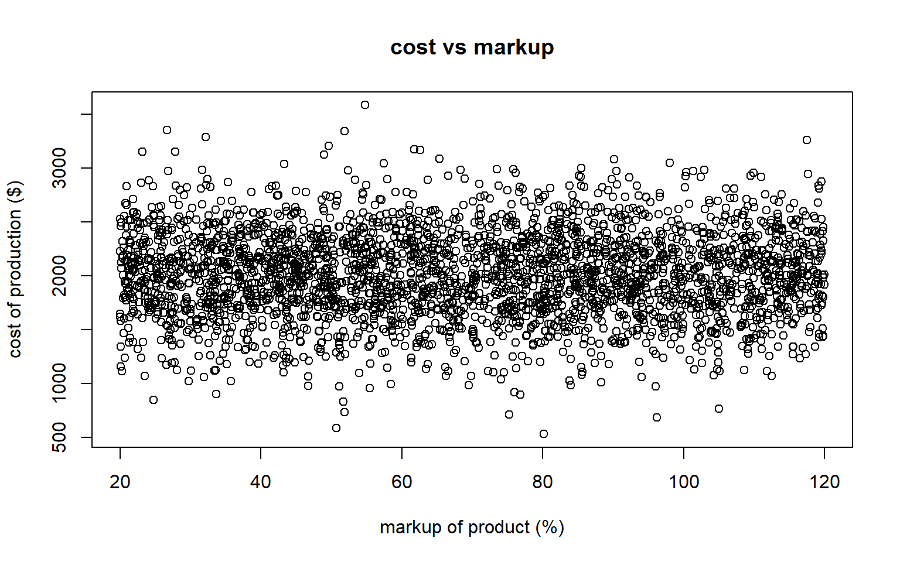

The first table summarizes the different covariates and outcome by type. Inspecting the average and quartiles of markup and cost between the different types, we don't notice any difference in the distributions. This implies that type is associated with neither the cost nor markup, which is a best case scenario for a logistic regression analysis. The proportion of successful sales is different among the product types with clothes and shoe products selling at a higher rate than the accessories. This implies that there may be an association between type and product sales. Clearly, there is an imbalance in the distribution of type in the data set, but we have enough cases of each product type such that including type in the logistic regression model shouldn't be a problem.

The second table summarizes markup and the cost variables by whether the product sold (the 1 group) or not (the 0 group). Comparing these two groups, we can clearly see that markup is lower in the groups that sold and indicates a negative association between sales and markup. The distribution of cost shifts about 100 dollars higher in the group that sold and thus suggests a positive association between cost and sales.

Finally, in the scatter plot comparing cost and markup, we observe random spread of the points. There is no indication of a linear or other functional relationship between markup and cost, which is an ideal scenario for logistic regression.

## Building a logistic regression model

Fitting a logistic regression model in R is a simple one line of code. Since we know what the true generating parameters are above, let's double check our work by comparing the fitted values to the true parameters.

``` r
fit <- glm(sold ~ 1 + markup + cost + type, 
           data = x_df,
           family = binomial)
ci <- confint(fit)
```

    Waiting for profiling to be done...

``` r
result <- data.frame(truth = true_beta, 
                     est = coef(fit),
                     ci_lwr = ci[,1],
                     ci_upr = ci[,2])

kable(result, digits = 4) %>% 
  kable_styling()
```

<div id="tbl-truefit">

|             |  truth |     est |  ci_lwr |  ci_upr |
|:------------|-------:|--------:|--------:|--------:|
| (Intercept) |  2.000 |  1.7716 |  0.7778 |  2.7816 |
| markup      | -0.200 | -0.2045 | -0.2272 | -0.1837 |
| cost        |  0.002 |  0.0021 |  0.0017 |  0.0026 |
| typeclothes |  1.000 |  0.8584 |  0.4595 |  1.2656 |
| typeshoes   |  1.500 |  1.8053 |  1.3052 |  2.3199 |

Table 2: Comparing estimates to true values. Estimates are on the log-odds scale
</div>

As expected with this rather large sample size, the estimates are fairly close to the true values and are well within the 95% confidence intervals. All of the parameter estimates are statistically significant as 0 is not within the confidence intervals, so this is a convincing model. At this step, one would normally interpret these values as odds ratios, but that is not the goal of this analysis, so I will skip the interpretation.

When building a logistic regression model, one usually has to consider a few different models to find the best fit to the data. Let's consider three other logistic regression models. One without type in the model but all other variables in the model:

$$
\log(\frac{\pi_i}{1 - \pi_i}) = \beta_0 + x_{markup} * \beta_{markup} + 
x_{cost} * \beta_{cost}
$$

a second model with a quadratic term for markup and including all the other variables:

$$
\log(\frac{\pi_i}{1 - \pi_i}) = \beta_0 + x_{markup} * \beta_{markup} + x_{markup}^2 * \beta_{markup^2} +
x_{cost} * \beta_{cost} + x_{type=shoes} * \beta_{type=shoes} + x_{type = clothes}*\beta_{type = clothes}
$$

and finally a simple model with just markup:

$$
\log(\frac{\pi_i}{1 - \pi_i}) = \beta_0 + x_{markup} * \beta_{markup}
$$

There are many model selection criteria to choose from and which one to use depends on the goal of the analysis. In this application, the goal is estimation and inference, so I would personally advocate for the Bayesian Information Criterion (BIC). The BIC is a quantity that expresses how well the proposed model fits the data while also balancing how many parameters are in a model. More parameters in a model results in a better fit to the data but too many parameters results in overfitting. The problem with an overfit model is the lack of generalizability to new data. Please refer to the BIC() documentation to see the formula for its calculation. BIC favors having less parameters in a model as compared to it's counterpart the Akaike Information Criterion (AIC). Therefore, the BIC is sometimes the preferred model selection criterion when the goal is to identify what covariates to go into a model.

Lower values of BIC indicate a better statistical model for the data. A difference of at least 2 is the typical threshold to consider one model superior the other. For differences of less than 2 the models are about equivalent and the statistician must decide which model is superior.

``` r
fit1 <- glm(sold ~ 1 + markup + cost, 
           data = x_df,
           family = binomial)
fit2 <- glm(sold ~ 1 + markup + I(markup^2) + cost + type, 
           data = x_df,
           family = binomial)
fit3 <- glm(sold ~ markup, data = x_df, family = binomial)

df_model_selection <- data.frame(model = c("True_model", "no_type", "quadratic_markup", "Simple_markup"), 
                                 bic = c(BIC(fit), BIC(fit1), BIC(fit2), BIC(fit3))
                                 ) 
df_model_selection %>%    
  kable(digits = 2, caption = "Smaller BIC indicates better model") %>%  
  kable_styling()
```

<div id="tbl-modselect">

| model            |     bic |
|:-----------------|--------:|
| True_model       |  927.72 |
| no_type          |  964.57 |
| quadratic_markup |  935.31 |
| Simple_markup    | 1046.51 |

Smaller BIC indicates better model

Table 3: Comparing Logistic Regression Models
</div>

Upon inspecting the BIC values, the true model is unsurprisingly the lowest BIC and thus the best model. Disregarding our knowledge of the true data generating model, the model chosen at this step strongly translates the trends observed in the exploratory data analysis step, and thus highlights the importance of exploring the data before building models. The simple model with just markup is clearly the worst model with the highest BIC, so although the simple model would drastically simplify our optimal estimation of $\pi_i$ in the next step, the data indicates a more complex relationship between the outcome and covariates is more appropriate.

Although we only inspect 4 models here, usually one would explore many more models and spend the bulk of their time trying to figure out the best model. More complex relationships like interactions and different functional transformations of continuous variables could be considered. Based on the exploratory analysis, this does not seem necessary in this analysis.

## Assessing Model Assumptions

Assessing whether the model assumptions are violated is often overlooked when fitting a logistic regression model. The main ones to assess are linearity of covariates (assumption 2), independent sampling (assumption 3), and multicollinearity (assumption 4). Perfect separation (assumption 5) is normally a warning from R if that occurs.

Based on the exploratory analysis earlier, multicollinearity is not likely not an issue in this data set. We know this for a fact because I generated the data independently. The exploratory analysis revealed that there wasn't any clear relationship between pairs of the covariates, and all of the parameters in the model are statistically significant. These are both great signs that multicollinearity is not present. However, to formally check for multicollinearity, one can check the Variance Inflation Factors (VIFs) in the covariates. I'll skip this step for now but one can read more on VIF theory here: https://online.stat.psu.edu/stat462/node/180/ and how to calculate it using the `car` package in R here: https://www.r-bloggers.com/2023/12/exploring-variance-inflation-factor-vif-in-r-a-practical-guide/.

I will note though that if one adds higher order terms in the regression, for example

$$
\log(\frac{\pi_i}{1 - \pi_i}) = \beta_0 + x_{markup} * \beta_{markup} + x_{markup}^2 * \beta_{markup^2}
$$ then instead of the VIF one will need to inspect the Generalized Variance Inflation Factor (GVIF).

The hardest assumption to verify is the linearity assumption. This only applies to continuous covariates which are markup and cost in this example. We can use the `binnedplot` function in the `arm` package to assess this. What this function does is bin or discretize the continuous variable into equally spaced segments. Within each segment, calculate the residual for the observations via:

$$
  residual_i = y_i - \hat \pi_i 
$$ where $\hat \pi_i$ is calculated from a proposed logistic regression model. We inspect the plot to make sure that the residuals are randomly scattered around the $y = 0$ horizontal line, there is no pattern in the residuals, and that at most ~5% of the residuals are outside of the confidence interval lines.

These binned residuals plots assume a large sample size for the statistical properties to hold. Specifically **if the sample size is large within each bin**, then the expected value of these residuals is 0 with known standard errors due to the Lindeberg-Feller central limit theorem. My personal rule-of-thumb is at least 30 observations to be reasonably confident in the approximation, but the more the better. Unfortunately, the binned plots from the arm package don't throw warnings when the bins have small sample size, so some caution is needed when interpretting these plots. In addition to large sample sizes, for values of $\hat \pi_i$ close to 0 or 1, the statistical theory does not hold, so bins with mostly very low or very high predicted values of $\hat \pi_i$ are not as informative.

``` r
## example on how the binned residual plot is constructed
rng <- range(x_df$cost) # min, max of markup
## break up range into 3 equal parts
breakpoints <- seq(from = rng[1],
                   to = rng[2],
                   by = diff(rng/3))
midpoints <- (breakpoints[-1] + breakpoints[-length(breakpoints)]) / 2
res <- x_df$sold - predict(fit, type = 'response')
res_df <- data.frame(res = res,
           bp = cut(x_df$cost, breaks = breakpoints))
res_ave <- aggregate(res ~ bp,
                     data = res_df,
                     FUN = mean)
plot(x = x_df$cost, y = res, 
     xlab = "cost",
     ylab = "Residuals: observed - predicted",
     main  = "How a binned residual plot is constructed",
     pch = 16)
points(x = midpoints, y = res_ave$res, 
       pch = 16, cex = 1.2,
       col = 'red')
abline(v = breakpoints, col = 'red')
legend("topright", 
       legend = c("observed_residual",
                  "average_residual"),
       col = c('black', 'red'),
       pch = 16)
```

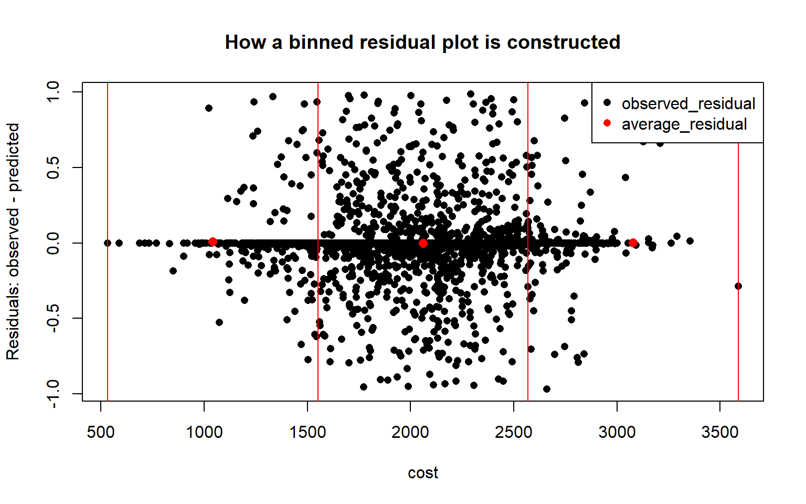

Let's look at several binned residual plots to assess whether our proposed model is reasonable.

``` r
res <- residuals(fit, type = "response")
binnedplot(x = fitted(fit),
           y = res, 
           nclass=NULL, 
           xlab="Expected Values", 
           ylab="Average residual", 
           main="Binned residual plot")
```

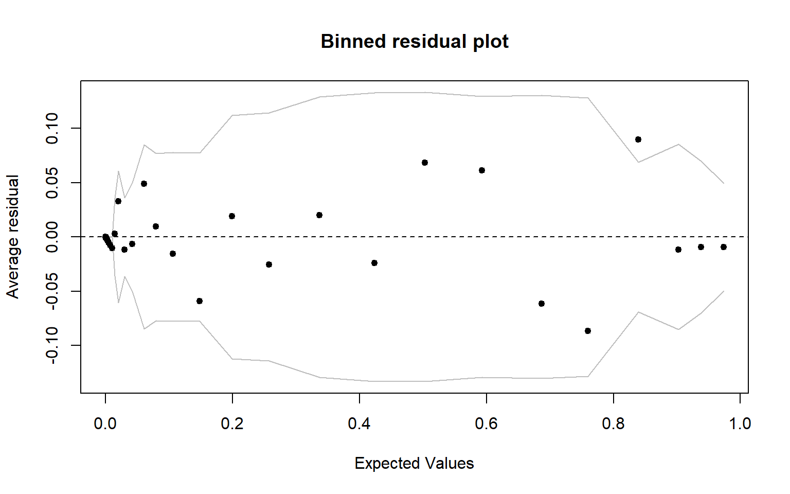

``` r
binnedplot(x = x_df$markup,
           y = res, 
           nclass=NULL, 
           xlab="Binned markup", 
           ylab="Average residual", 
           main="Binned residual plot of markup")
```

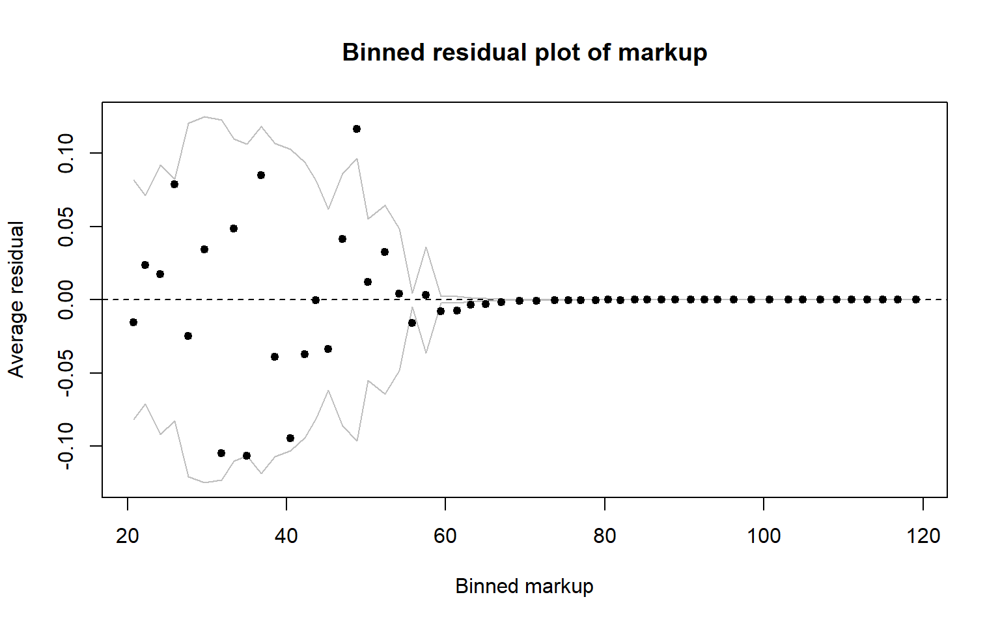

``` r
binnedplot(x = x_df$cost,
           y = res, 
           nclass=NULL, 
           xlab="Binned cost", 
           ylab="Average residual", 
           main="Binned residual plot of cost")
```

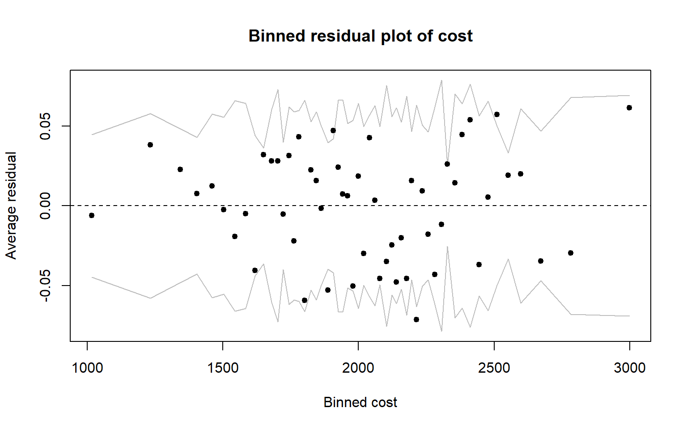

# Optimizing the Expected Returns (Expected Revenue)

## Relationship between $x_{markup}$ and $\pi_i$

Now that we have decided on a logistic regression model, let's explore the relationship between markup and the probability of selling the product. The relationship between markup and the log-odds might be linear, but when we invert the problem to get the relationship between markup and the probability it is certainly non-linear. To produce this non-linear relationship, we can invert the log-odds back to the probability scale through the following formula:

$$
\pi_i = (1 + \exp[-(\beta_0 + x_{markup} * \beta_{markup} + 
x_{cost} * \beta_{cost} + x_{type=shoes} * \beta_{type=shoes} + x_{type = clothes}*\beta_{type = clothes})])^{-1}
$$

We are specifically interested in how markup relates to the probability of selling, but we have the other data variables in the formula. Before exploring how the probability of selling changes over a range of values for markup, it is pertinent to choose some representative values for cost and type. To start with, let's set the cost level to be the observed average cost level and let type be the most common type in the data set to provide a curve.

``` r
## there isn't a mode function in base R
getMode <- function(x){
  lx <- levels(x)
  ux <- unique(lx)
  factor(ux[which.max(tabulate(match(lx, ux)))], levels = lx)
}
range_markup <- seq(from = 0, to = 75, by = 1)
mode_type <- getMode(x_df$type)
mean_cost <- mean(x_df$cost)
new_x_df <- data.frame("markup" = range_markup,
                       "cost" = mean_cost,
                       "type" = mode_type)

preds <- predict(fit, newdata = new_x_df, se.fit = TRUE)
preds_ci_upr <- preds$fit + qnorm(0.975)*preds$se.fit
preds_ci_lwr <- preds$fit - qnorm(0.975)*preds$se.fit
probs_df <- data.frame(pred_prob = inverse_logit(preds$fit),
                       pred_prob_lwr = inverse_logit(preds_ci_lwr),
                       pred_prob_upr = inverse_logit(preds_ci_upr),
                       markup = range_markup)

true_probs <- model.matrix(~ markup + cost + type, data = new_x_df) %*% true_beta
probs_df$true_probs <- inverse_logit(true_probs)


ggplot(probs_df) + 
  ## probability curve predicted from logistic regression in black
  geom_line(aes(x = markup, y = pred_prob)) + 
  ## 95% wald CI in red
  geom_line(aes(x = markup, y = pred_prob_upr), col = "red") + 
  geom_line(aes(x = markup, y = pred_prob_lwr), col = "red") + 
  ## probability curve using true values will be in blue
  geom_line(aes(x = markup, y = true_probs), col = "blue") + 
  ggtitle(paste0("Probablity of Selling Product vs markup percentage"),
          subtitle = paste0("type = ", mode_type[1], 
                            "  cost = ", 
                            round(mean_cost[1], digits = 2)
                            )
  ) + 
  labs(x = "markup (%)", y = "Probability of Selling Product")
```

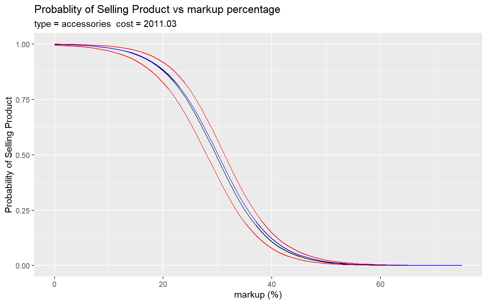

As expected, due to how well our estimates of the parameters are, the estimated probability curve in black is mostly overlapped by expected probabilities calculated from the true parameters in blue. As we can see from the graph above, the probability of selling decreases as markup increases. This isn't surprising given that the true parameter for markup is -0.02.

Let's plot the differences between the true and predicted probabilities to really show how small the difference in magnitude is. We can see that the probabilities only differ at most by 0.02. Depending on the application context, this can be a meaningful difference or not, but for this application let's assume that an underestimation of 0.02 is a reasonably close estimate.

``` r
plot(x = probs_df$markup, 
     y = probs_df$true_probs - probs_df$pred_prob,
     type = 'h',
     ylab = "True Prob - Pred Prob",
     xlab = "markup",
     main = "Difference between True and Predicted Probabilities")
```

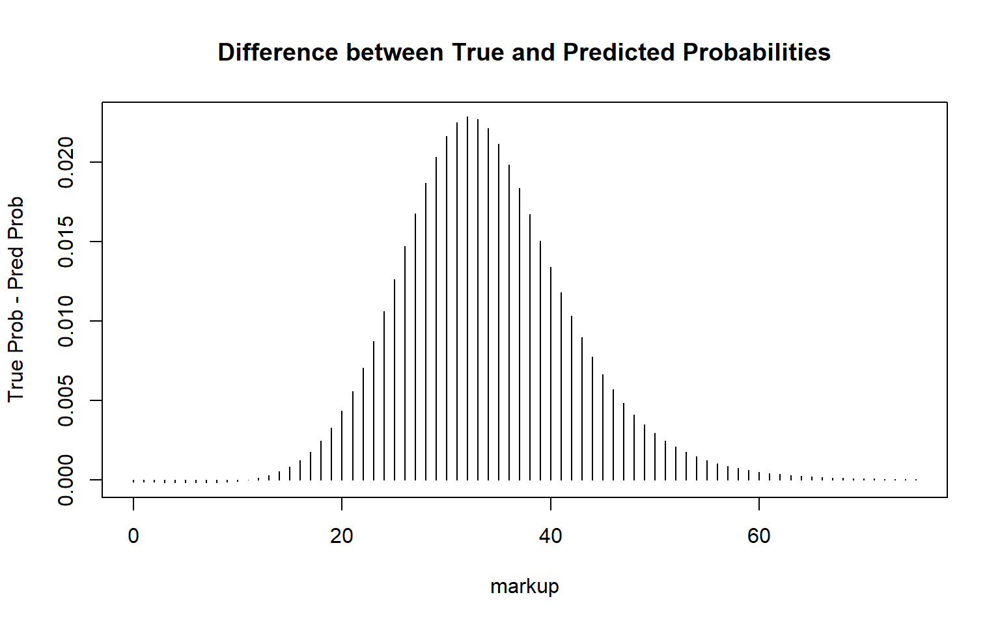

## Calculating the Optimal markup

We can propose the following function to express a balance between optimizing cost markup while increasing the probability of successfully selling the product:

$f(x_{markup}) = (1 + \frac{x_{markup}}{100})x_{cost} \pi_i$

This function is derived from the idea of the expected total revenue generated by a new product. The new products total revenue is expressed as $(1 + \frac{x_{markup}}{100})*x_{cost}$ and the expected value of a new observation $Y_i$ is $\pi_i$ because $Y_i$ is a Bernoulli random variable (see appendix for small derivation). Thus, the expected total revenue generated from this product is the multiplication of these two quantities.

The calculation of $\pi_i$ depends on $x_{markup}$ and $x_{cost}$.

``` r
expected_return <- function(markup, cost, type, fit, log = FALSE){
  new_data <- data.frame(markup = markup,
                         cost = cost,
                         type = type)
  # if(markup < 0){
  #   return(-Inf)
  # }
  
  if(log){
   ### doing optimization on the log scale is more stable, if markup > 0
    log(1 + markup/100) + log(cost) + 
      log(predict(fit, newdata = new_data, type = "response"))
  }else{
   (1 + markup/100)*cost * #total sale price
    predict(fit, newdata = new_data, type = "response") #prob success 
  }
}

optimal_vals <- optim(par = 50, 
      fn = expected_return, 
      method = "BFGS",
      control = list(fnscale = -1), # do maximization not minimization
      # These params don't change
      cost = mean_cost[1], type = mode_type[1], fit = fit 
      )

if(optimal_vals$convergence != 0){
  stop("The numerical optimization did not converge")
}else{
  new_data <- data.frame(markup = optimal_vals$par,
                         cost = mean_cost[1],
                         type = mode_type[1])
  optimal_prob_success <- inverse_logit(predict(fit, new_data))
  optimal_df <- data.frame(optimal_markup = optimal_vals$par,
                           expected_total_cost = optimal_vals$value,
                           type = mode_type[1],
                           cost = mean_cost[1],
                           prob_success = optimal_prob_success)
  kable(optimal_df, digits = 3, align = 'c') %>%
    kable_styling()
}
```

| optimal_markup | expected_total_cost |    type     |   cost   | prob_success |
|:--------------:|:-------------------:|:-----------:|:--------:|:------------:|
|     14.48      |      2203.908       | accessories | 2011.027 |    0.957     |

From this analysis, we find that for an accessory product that costs of \$2011.03to produce, the optimal markup is about 14.48 percent. This results in a total revenue generated of \$2203.91.

Although our formula calculates an optimal markup of 14.48 percent, we need to keep in mind that the range of markup in the data set are values between 20 and 120 percent. Thus, a markup of 14.48 percent is outside the region covered by the data. I would suggest collecting more data in this range before widely adopting this decision rule.

In this section we only looked at one specific combination of covariates. Of course, we may want to consider cases with combinations of product costs and product types. To explore these different scenarios more easily, I've created a Rshiny dashboard that'll be linked below when it's done.

## Hypothetical Impact of Optimal Markup strategy

Let's assess the business impact of this optimal markup strategy is in terms of two important outcomes:

1.  The change in successful sales compared to the observed sales data

2.  The change in revenue generated compared to the observed revenue

For each point in our data set, we will substitute the observed optimal markup strategy with the optimal markup and check the change in sales and revenue.

``` r
calc_optimal_markup <- function(cost, type, fit){
  optim(par = 50, 
      fn = expected_return, 
      method = "BFGS",
      control = list(fnscale = -1), # do maximization not minimization
      # These params don't change
      cost = cost, type = type, fit = fit 
      )  
}

optimal_markups <- mapply(calc_optimal_markup, 
                          cost = x_df$cost, 
                          type = x_df$type, 
                          MoreArgs = list(fit = fit))
optimal_x_df <- x_df
optimal_x_df$markup <- unlist(optimal_markups[1,])

hist(optimal_x_df$markup)
```

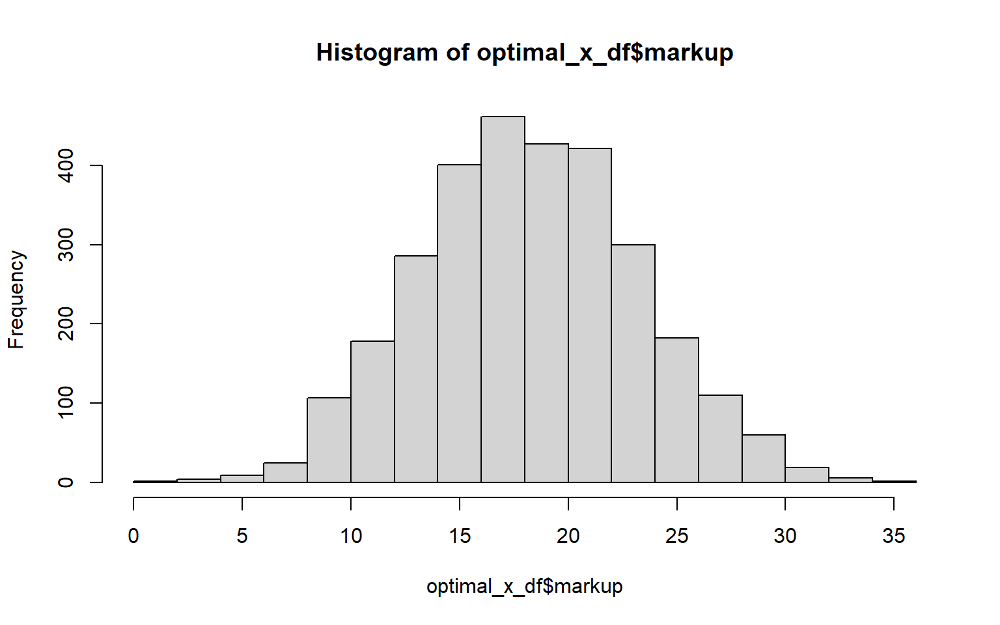

``` r
hypothetical_probs <- predict(fit, 
                              newdata = optimal_x_df, 
                              type = 'response')
est_probs <- predict(fit, newdata = x_df, type = 'response')

set.seed(2013)
expected_results <- replicate(5000,
          expr = {
            hypothetical_success <- rbinom(sample_size, 1, hypothetical_probs)
            c(change_sales = sum(hypothetical_success) - sum(x_df$sold),
              change_rev = sum(hypothetical_success * (1 + optimal_x_df$markup/100)*x_df$cost) - 
                           sum(x_df$sold * (1 + x_df$markup/100)*x_df$cost)
            )
          })
obs_revenue <- sum(x_df$sold * (1 + x_df$markup/100)*x_df$cost)

optimal_results <- data.frame(ave_change_sales = mean(expected_results[1,]),
                              ave_change_revenue = mean(expected_results[2,]),
                              ave_percent_change_sales = mean(expected_results[1,])/sum(x_df$sold),
                              ave_percent_change_revenue = mean(expected_results[2,]) / obs_revenue)
optimal_results
```

      ave_change_sales ave_change_revenue ave_percent_change_sales
    1         2433.894            5664458                 5.506547
      ave_percent_change_revenue
    1                     4.6332

# Discussion

Easy to extend to

# Practical Considerations During Analysis

## Model Misspecification

One may be tempted to fit a simpler logistic regression model that just includes markup and an intercept term because markup is the only relationship we are interested in exploring. In the optimization step outline earlier, this model simplifies the calculations significantly as we do not need to set fixed values for type and cost. However, if we choose to ignore the "true" relationship between the data variables and the outcome then we introduce significant bias in our estimates and predictions. Using the same data from earlier, let's inspect the relationship of the estimated probability of recovery and markup under this simpler model:

$$
  \log(\frac{\pi_i}{1 - \pi_i}) = \beta_0 + x_{markup}*\beta_{markup}
$$

``` r
fit_reduced <- glm(sold ~ markup, data = x_df, family = binomial()) 
# summary(fit_reduced)  
new_x_df <- data.frame("markup" = range_markup,                        
                       "cost" = mean_cost,                        
                       "type" = mode_type)  

preds <- predict(fit_reduced, newdata = new_x_df, se.fit = TRUE) 
preds_ci_upr <- preds$fit + qnorm(0.975)*preds$se.fit 
preds_ci_lwr <- preds$fit - qnorm(0.975)*preds$se.fit 
probs_df <- data.frame(pred_prob = inverse_logit(preds$fit), 
                       pred_prob_lwr = inverse_logit(preds_ci_lwr), 
                       pred_prob_upr = inverse_logit(preds_ci_upr),  
                       markup = range_markup)  
true_probs <- model.matrix(~ markup + cost + type, data = new_x_df) %*% true_beta 
probs_df$true_probs <- inverse_logit(true_probs)  
# mean(probs_df$pred_prob - probs_df$true_probs)   
ggplot(probs_df) +    
  geom_line(aes(x = markup, y = pred_prob)) +    
  geom_line(aes(x = markup, y = pred_prob_upr), col = "red") +    
  geom_line(aes(x = markup, y = pred_prob_lwr), col = "red") +    
  geom_line(aes(x = markup, y = true_probs), col = "blue") +    
  ggtitle(paste0("Probablity of sale vs markup"),
          subtitle = paste0("type = ", mode_type[1],  
                            "  cost = ", 
                            round(mean_cost[1], digits = 2)   
                            )   
          )
```

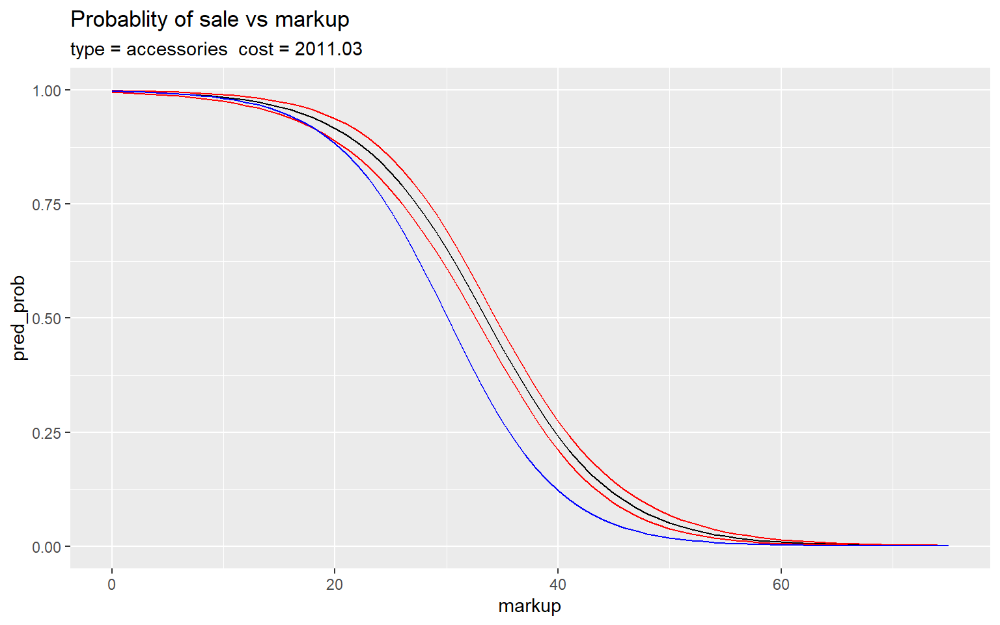

Very clearly, the true probability curve in blue is outside of the 95% confidence intervals for most of values of markup. The bias is mild at first but quickly diverges after around markup = 20. In this example curve, the estimated probability is higher than the true probability so any decisions made off the estimated probability will be over optimistic and thus lead to waste of markup doses. This clearly highlights the importance of an exploratory analysis in addition to model selection steps to avoid bias in the logistic regression model.

## Influential Data Points and Sample Size

This question has come to me multiple times where sometimes the data is "biased" in some way where some subgroup of the data is underrepresented. The specific case we'll focus on is when some interval of values for a continuous covariate are not observed. For example, suppose that in the data we didn't observe any points that costed between 2000 and 2100. Is this necessarily a problem? Well, it depends on whether these unobserved values follow the same pattern as the rest of the observed data.

First, one needs to consider what the application of the study is. If the analysis is for a scientific experiment and the goal is inference, then generally no this violation reveals some error in the experimental setup and thus the inference is hard to justify. If we are not in such a strict scenario, such as the scenario presented in the problem, well then the bias *can* be a problem, but it *depends* on the truth, the quality of the data, and the sample size.

To simulate this scenario, we will bias the data set from earlier in two (rather extreme) ways:

1.  People with a cost in the range of 2000-2100mg chose not to participate in the study.
2.  People with markup in the range of 70-80% chose not to participate in the study

``` r
x_df_bias <- filter(x_df, cost < 2000 | cost > 2100)

fit_bias <- glm(sold ~ 1 + markup + cost + type, 
                data = x_df_bias,
                family = binomial)

ci_bias <- confint(fit_bias)
```

    Waiting for profiling to be done...

``` r
result <- data.frame(truth = true_beta, 
                     full_est = coef(fit),
                     bias_est = coef(fit_bias),
                     bias_ci_lwr = ci_bias[,1],
                     bias_ci_upr = ci_bias[,2])
kable(result, digits = 4, caption = "Estimates when cost is biased") %>% 
  kable_styling()
```

|             |  truth | full_est | bias_est | bias_ci_lwr | bias_ci_upr |
|:------------|-------:|---------:|---------:|------------:|------------:|
| (Intercept) |  2.000 |   1.7716 |   1.7881 |      0.7845 |      2.8097 |
| markup      | -0.200 |  -0.2045 |  -0.2046 |     -0.2284 |     -0.1828 |
| cost        |  0.002 |   0.0021 |   0.0022 |      0.0017 |      0.0026 |
| typeclothes |  1.000 |   0.8584 |   0.8135 |      0.3934 |      1.2423 |
| typeshoes   |  1.500 |   1.8053 |   1.7858 |      1.2682 |      2.3194 |

Estimates when cost is biased

``` r
x_df_bias2 <- filter(x_df, markup < 70 | markup > 80)

fit_bias2 <- glm(sold ~ 1 + markup + cost + type, 
                data = x_df_bias2,
                family = binomial)

ci_bias <- confint(fit_bias2)
```

    Waiting for profiling to be done...

``` r
sample_sizes <- data.frame(full = sample_size,
                           bias1 = nrow(x_df_bias),
                           bias2 = nrow(x_df_bias2))

result <- data.frame(truth = true_beta,
                     full_est = coef(fit),
                     bias_est = coef(fit_bias2),
                     bias_ci_lwr = ci_bias[,1],
                     bias_ci_upr = ci_bias[,2])
kable(result, digits = 4, caption = "Estimates when markup is biased") %>%
  kable_styling()
```

|             |  truth | full_est | bias_est | bias_ci_lwr | bias_ci_upr |
|:------------|-------:|---------:|---------:|------------:|------------:|
| (Intercept) |  2.000 |   1.7716 |   1.7590 |      0.7637 |      2.7703 |
| markup      | -0.200 |  -0.2045 |  -0.2040 |     -0.2267 |     -0.1830 |
| cost        |  0.002 |   0.0021 |   0.0021 |      0.0017 |      0.0026 |
| typeclothes |  1.000 |   0.8584 |   0.8577 |      0.4590 |      1.2646 |
| typeshoes   |  1.500 |   1.8053 |   1.8034 |      1.3035 |      2.3177 |

Estimates when markup is biased

Even though we excluded a specific portion of our target population the estimates shifted but not by a lot. In fact, the inference is still rather okay under these conditions despite the bias (see appendix: simulation study of bias in estimates due to interval of missing values). This is actually not completely unexpected and relates to the concept of influential data points when conducting a data analysis. There are multiple ways to measure influence in data with respect to a generalized linear model, the one most pertinent to this concept is DFBETA(S).

DFBETA(S) measures the change in a parameter estimate when a single data point is deleted from the model. The formula to calculate this measurement is expressed as:

$$DFBETAS_j = \frac{\hat \beta_j - \hat \beta_{(i)j}}{SE(\hat \beta_j)}$$

Where $j$ is the index for each beta parameter in the regression model, $\hat \beta_{(i)j}$ is the estimated beta parameter when the $i$th data point is deleted, and $SE(\hat \beta_j)$ is the standard error for the $\beta_j$ parameter.

We can calculate this for each of the data points in our sample and a rule of thumb is that points with a DFBETA(S) greater than $\pm \frac{2}{\sqrt n}$ are highly influential where $n$ is the sample size of the data. The S in DFBETA(S) stands for standardized and is why the denominator is the standard error of $\hat \beta_j$. The parentheses in the name are just to emphasize the standardization part, I'll drop them from here on out.

Let's inspect the DFBETAS for the full model to get an idea of how influential our data is.

``` r
dfbetas_vals <- data.frame(dfbetas(fit)) 
colnames(dfbetas_vals)[1] <- "intercept" 
threshold <- sqrt(4/sample_size) 

for(i in 1:ncol(dfbetas_vals)){ 
  y <- dfbetas_vals[,i] 
  plot(y, 
       type = 'h', 
       main = paste0("DFBETAS plot for ", colnames(dfbetas_vals)[i]),
       ylim = c(min(c(y, -1*threshold)), max(c(y, threshold)))
       ) 
  abline(h = c(-1,1)*threshold, col = 'red') 
  text(x = 0, 
       max(y), 
       adj = 0, 
       paste0("Proportion of highly influential points = ", 
              mean(abs(y) > threshold)) 
       ) 
}
```

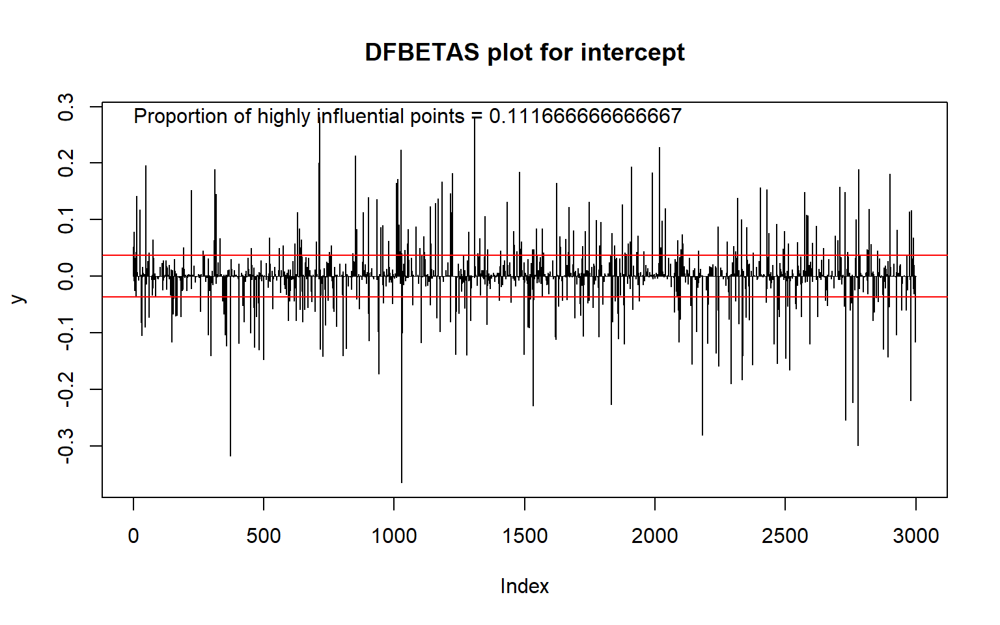

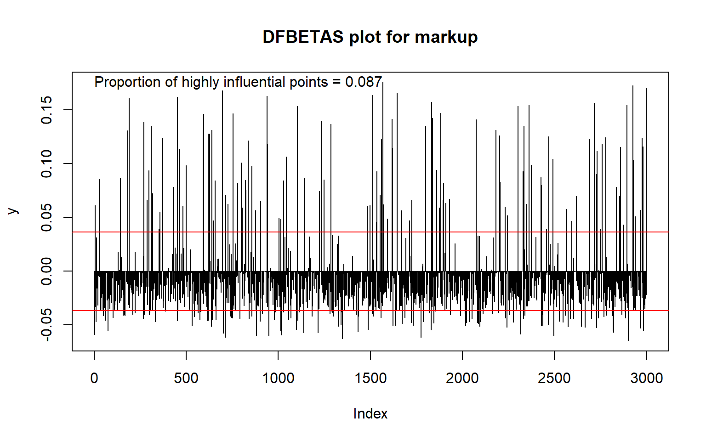

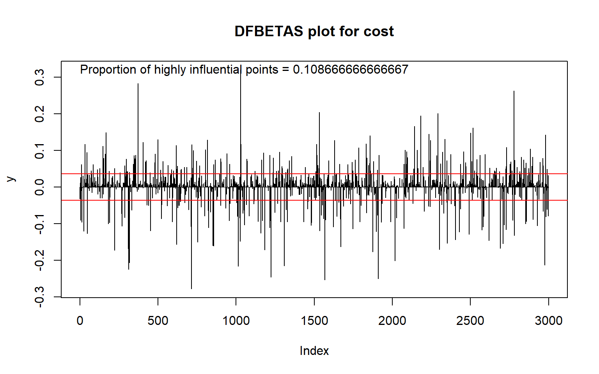

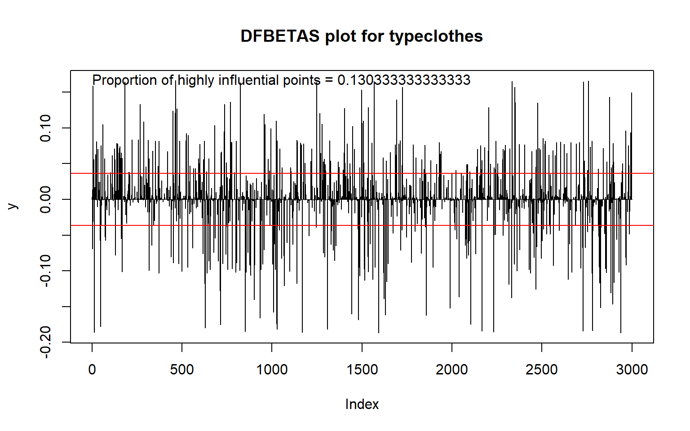

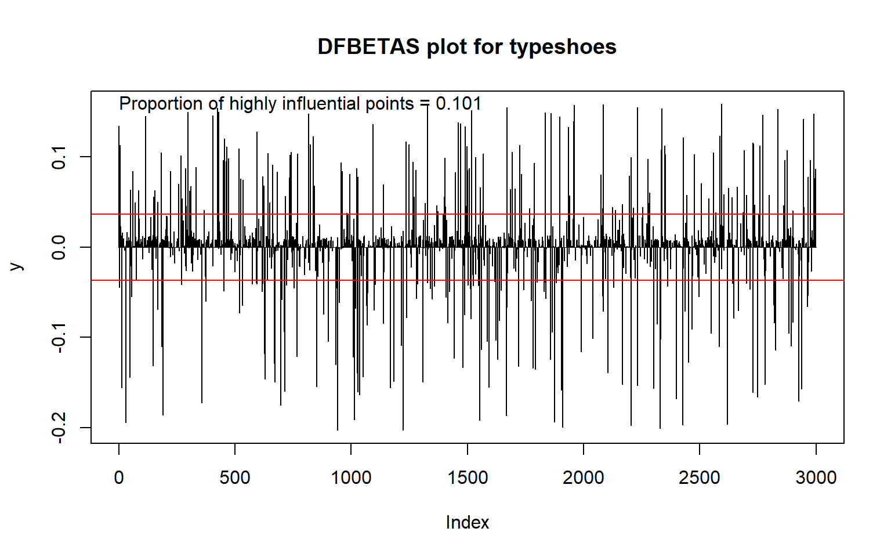

``` r
# idx <- abs(dfbetas_vals$markup) > threshold
# summary(x_df[idx,])
# summary(x_df)
```

Here we can see somewhere around 10% of the points are influential relative to the $\pm \frac{2}{\sqrt n}$ cut off for each of the beta parameters in the logistic regression. In a real world analysis we would inspect these points to determine if there is a pattern emerging from these influential points and appropriately exclude or try to adjust for any implied bias.

Although not immediately obvious from the formula for DFBETAS, the sample size impacts how influential a single data point is on the estimation. Generally speaking, the larger the sample size then the lower magnitude of the influence of a single data point on estimating parameters. Thus, for a large sample size like the one in this simulated data set, the influence is small and is the reason why deleting a small portion of the data set had minimal effect on the parameter estimates.

The lesson here is that, for any "biased" data set, the influence may or may not strongly impact the parameters estimates depending on whether the biased data excluded any of these highly influential data points. Because we are in the context of a simulation problem, it's obvious to us how big this influence is because we know the truth. In real applications, we never know how big the influence is; all we know is that a bias in estimates will exist. For instance, if the data was biased in a way that a subset of the target population is excluded, then we will never know how those unobserved data points would impact the parameter estimates. This is where statistical analysis becomes a bit more of an art than a science.

``` r
simulate_fit_data <- function(i, bias_data = TRUE, ...){
  sample_size <- 3000

  true_beta <- c(2, # intercept
                 -0.2, # markup
                 0.002, # cost
                 1, # type=clothes
                 1.5 )# type=shoes
  
  ### Simulate data
  
  type <- sample(c("accessories", "clothes", "shoes"), 
                 size = sample_size,
                 replace = TRUE,
                 prob = c(0.3, 0.5, 0.2))
  cost <- rnorm(sample_size, mean = 2000, sd = 400)
  markup <- runif(sample_size, min = 20, max = 120)
  
  ### make markup and cost are above 0
  
  markup <- ifelse(markup <= 0, 10, markup)
  cost <- ifelse(cost <= 0, 2000, cost)
  
  # convert type into a factor variable to prepare for analysis
  
  type <- factor(type, levels = c("accessories", "clothes", "shoes"))
  
  x_df <- data.frame(markup = markup, cost = cost, type = type)
  
  # get x_matrix
  
  x_matrix <- model.matrix(~ 1 + markup + cost + type, data = x_df)
  
  #simulated log-odds per person
  
  log_odds <- x_matrix %*% true_beta
  
  #convert log_odds to probabilities
  
  inverse_logit <- function(x){(1 + exp(-x))^-1}
  true_probs <- inverse_logit(log_odds)
  
  # get the outcome
  sold <- rbinom(sample_size, 1, true_probs)
  x_df$sold <- sold
  x_df
  if(bias_data){
    x_df_bias <- x_df_bias <- filter(x_df, cost < 2000 | cost > 2100)
  }else{
    x_df_bias <- x_df
  }
  
  fit <- glm(sold ~ 1 + markup + cost + type, 
           data = x_df_bias,
           family = binomial)
  bias <- coef(fit) - true_beta
  ci <- confint(fit)
  ## check whether true parameters are within the confidence interval
  cover <- (ci[,1] < true_beta) & (true_beta < ci[,2])
  out <- c(bias, cover)
  names(out) <- c(names(bias), paste0("cover", names(bias)))
  out
}
set.seed(123123)
library(parallel)
cl <- makeCluster(detectCores() - 1)
clusterEvalQ(cl, suppressPackageStartupMessages(library(dplyr)))
clusterSetRNGStream(cl)
nreps <- 10000
rep_results_biased <- parSapply(cl, 1:nreps, simulate_fit_data, bias_data = TRUE)
rep_results <- parSapply(cl, 1:nreps, simulate_fit_data, bias_data = FALSE)
stopCluster(cl)
rowMeans(rep_results)
rowMeans(rep_results_biased)
```

### What to do about percieved bias in a data set

For each of the bias scenarios, I would first investigate why the sampling bias occurred. Perhaps it was an expected phenomena such as one does not sell products at those cost levels. In this case, we simply redefine the target population of inference to exclude that unobserved sub--population.

If the sampling bias was not expected in the data and it isn't feasible to collect data from missing sub-population, then what to do next really depends. First I would assess how well the model fits the data and the quality of the data. The data in this example is simulated, so the data quality is perfect (i.e. no correlation between covariates, large enough sample size). An easy next step is to look at some measures of internal model validity like a calibration curve between the predictions and the observed values and cross validation.

TODO: Explanation of calibration curves goes here

``` r
library(CalibrationCurves)
val.prob.ci.2(predict(fit_bias, type = "response"), fit_bias$y, main = "Biased cost sampling")
```

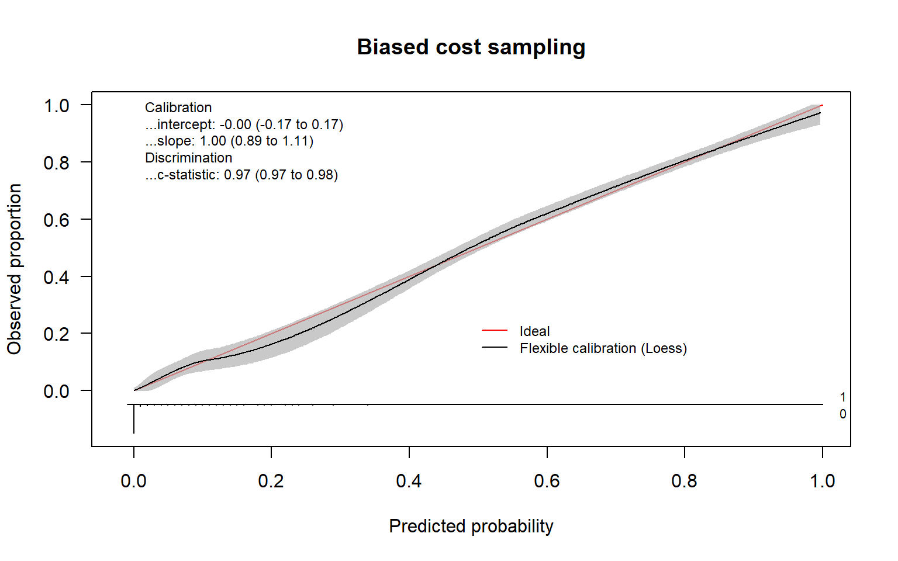

    Call:
    val.prob.ci.2(p = predict(fit_bias, type = "response"), y = fit_bias$y, 
        main = "Biased cost sampling")

    A 95% confidence interval is given for the calibration intercept, calibration slope and c-statistic. 

              Dxy       C (ROC)            R2             D      D:Chi-sq 
     9.455531e-01  9.727765e-01  7.377389e-01  5.421879e-01  1.481173e+03 
              D:p             U      U:Chi-sq           U:p             Q 
     0.000000e+00 -7.326007e-04  4.547474e-13  1.000000e+00  5.429205e-01 
            Brier     Intercept         Slope          Emax  Brier scaled 
     4.639351e-02 -6.178465e-09  1.000000e+00  3.418414e-09  6.320478e-01 
             Eavg           ECI 
     5.579221e-03  1.200259e-02 

``` r
val.prob.ci.2(predict(fit_bias2, type = "response"), fit_bias2$y, main = "Biased markup sampling")
```

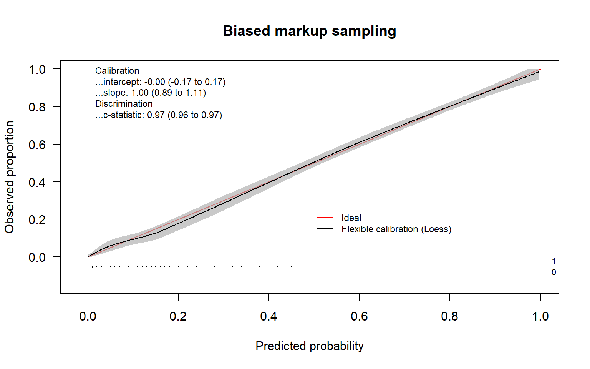

    Call:
    val.prob.ci.2(p = predict(fit_bias2, type = "response"), y = fit_bias2$y, 
        main = "Biased markup sampling")

    A 95% confidence interval is given for the calibration intercept, calibration slope and c-statistic. 

              Dxy       C (ROC)            R2             D      D:Chi-sq 
     9.377667e-01  9.688834e-01  7.293933e-01  5.629314e-01  1.517537e+03 
              D:p             U      U:Chi-sq           U:p             Q 
     0.000000e+00 -7.423905e-04 -3.410605e-13  1.000000e+00  5.636738e-01 
            Brier     Intercept         Slope          Emax  Brier scaled 
     5.170820e-02 -1.478349e-09  1.000000e+00  8.040748e-10  6.229804e-01 
             Eavg           ECI 
     4.285675e-03  4.562992e-03 

# Appendix: Deriving expected revenue formula

First, we calculate that $(1 + \frac{x_{markup}}{100})x_{cost}$ would be the sales price of the item (ignoring any taxes).

Next let's derive a simple random variable $Z_i$ to represent the revenue generated from each sale. Consider the random variable $Z_i$ which is a transformation of our previous outcome variable $Y_i$:

$$Z_i = (1 + \frac{x_{markup}}{100})x_{cost} Y_i$$

A straightforward application of deriving shows that

$$\mathbb E(Z_i) = (1 + \frac{x_{markup}}{100})x_{cost} \mathbb E(Y_i) =  (1 + \frac{x_{markup}}{100})x_{cost} \pi_i$$

We have a (maximum-likelihood) estimate of $\pi_i$ that we will denote as $\hat \pi_i$. Thus our (maximum-likelihood) estimate of $E(Z_i)$ is

$\widehat{\mathbb E(Z_i)} = (1 + \frac{x_{markup}}{100})x_{cost} \hat \pi_i$.

For the more statistically rigorous, the expectations here are conditional on the covariates in the logistic regression model and $\widehat{\mathbb E(Z_i)}$ is a maximum-likelihood estimator of $\mathbb E(Z_i)$.

# Session Info and Bibliography

``` r
sessionInfo()
```

    R version 4.5.2 (2025-10-31 ucrt)
    Platform: x86_64-w64-mingw32/x64
    Running under: Windows 11 x64 (build 26100)

    Matrix products: default
      LAPACK version 3.12.1

    locale:
    [1] LC_COLLATE=English_United States.utf8 
    [2] LC_CTYPE=en_US.UTF-8                  
    [3] LC_MONETARY=English_United States.utf8
    [4] LC_NUMERIC=C                          
    [5] LC_TIME=English_United States.utf8    

    time zone: Pacific/Honolulu
    tzcode source: internal

    attached base packages:
    [1] stats     graphics  grDevices utils     datasets  methods   base     

    other attached packages:
     [1] CalibrationCurves_3.0.0 rms_8.1-0               Hmisc_5.2-4            
     [4] ggplot2_4.0.1           dplyr_1.1.4             gtsummary_2.5.0        
     [7] arm_1.14-4              lme4_1.1-38             Matrix_1.7-4           
    [10] MASS_7.3-65             kableExtra_1.4.0        knitr_1.51             

    loaded via a namespace (and not attached):
      [1] mathjaxr_2.0-0            RColorBrewer_1.1-3       
      [3] rstudioapi_0.17.1         jsonlite_2.0.0           
      [5] shape_1.4.6.1             magrittr_2.0.4           
      [7] TH.data_1.1-5             farver_2.1.2             
      [9] nloptr_2.2.1              rmarkdown_2.30           
     [11] fs_1.6.6                  vctrs_0.6.5              
     [13] minqa_1.2.8               CompQuadForm_1.4.4       
     [15] base64enc_0.1-3           htmltools_0.5.9          
     [17] forcats_1.0.1             polspline_1.1.25         
     [19] broom_1.0.11              Formula_1.2-5            
     [21] sass_0.4.10               parallelly_1.46.0        
     [23] htmlwidgets_1.6.4         sandwich_3.1-1           
     [25] zoo_1.8-15                gt_1.2.0                 
     [27] commonmark_2.0.0          mime_0.13                
     [29] lifecycle_1.0.4           cmprsk_2.2-12            
     [31] iterators_1.0.14          pkgconfig_2.0.3          
     [33] R6_2.6.1                  fastmap_1.2.0            
     [35] rbibutils_2.4             future_1.68.0            
     [37] shiny_1.12.1              digest_0.6.39            
     [39] numDeriv_2016.8-1.1       colorspace_2.1-2         
     [41] furrr_0.3.1               textshaping_1.0.4        
     [43] labeling_0.4.3            metadat_1.4-0            
     [45] abind_1.4-8               riskRegression_2025.09.17
     [47] compiler_4.5.2            withr_3.0.2              
     [49] htmlTable_2.4.3           S7_0.2.1                 
     [51] backports_1.5.0           metafor_4.8-0            
     [53] meta_8.2-1                broom.mixed_0.2.9.6      
     [55] lava_1.8.2                quantreg_6.1             
     [57] tools_4.5.2               foreign_0.8-90           
     [59] otel_0.2.0                httpuv_1.6.16            
     [61] future.apply_1.20.1       nnet_7.3-20              
     [63] glue_1.8.0                promises_1.5.0           
     [65] mets_1.3.8                nlme_3.1-168             
     [67] grid_4.5.2                checkmate_2.3.3          
     [69] cluster_2.1.8.1           generics_0.1.4           
     [71] gtable_0.3.6              tzdb_0.5.0               
     [73] tidyr_1.3.2               data.table_1.18.0        
     [75] hms_1.1.4                 xml2_1.5.1               
     [77] foreach_1.5.2             pillar_1.11.1            
     [79] markdown_2.0              stringr_1.6.0            
     [81] merTools_0.6.3            later_1.4.4              
     [83] splines_4.5.2             lattice_0.22-7           
     [85] survival_3.8-3            SparseM_1.84-2           
     [87] tidyselect_1.2.1          blme_1.0-6               
     [89] reformulas_0.4.3          gridExtra_2.3            
     [91] bookdown_0.46             litedown_0.9             
     [93] svglite_2.2.2             xfun_0.55                
     [95] stringi_1.8.7             yaml_2.3.12              
     [97] boot_1.3-32               pec_2025.06.24           
     [99] evaluate_1.0.5            codetools_0.2-20         
    [101] tibble_3.3.0              cli_3.6.5                
    [103] rpart_4.1.24              xtable_1.8-4             
    [105] systemfonts_1.3.1         Rdpack_2.6.4             
    [107] Rcpp_1.1.0                globals_0.18.0           
    [109] coda_0.19-4.1             parallel_4.5.2           
    [111] MatrixModels_0.5-4        readr_2.1.6              
    [113] timeROC_0.4               listenv_0.10.0           
    [115] glmnet_4.1-10             viridisLite_0.4.2        
    [117] mvtnorm_1.3-3             timereg_2.0.7            
    [119] scales_1.4.0              prodlim_2025.04.28       
    [121] purrr_1.2.0               rlang_1.1.6              
    [123] multcomp_1.4-29           cards_0.7.1              

[^1]: There is an extension of logistic regression to group level data where the outcome is the number of successes observed and is modeled as a binomial random variable.
